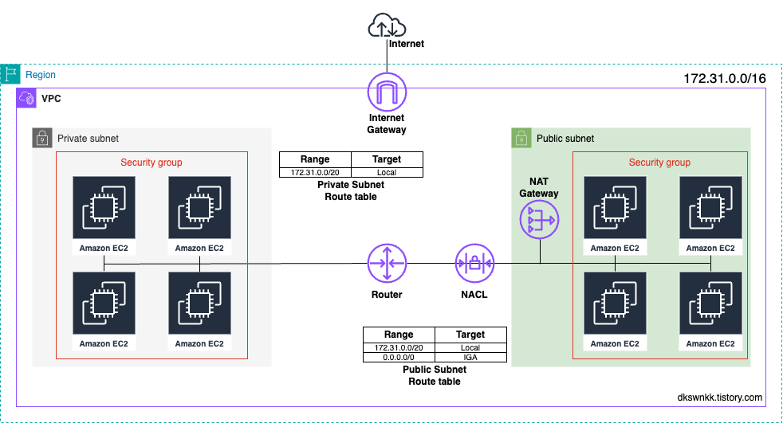
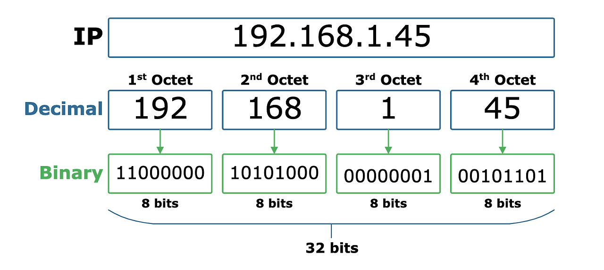
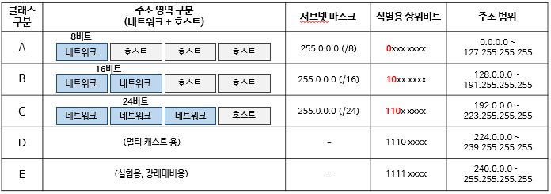

# [AWS] VPC

<!--more-->
<!-- Table of contents -->
* this unordered seed list will be replaced by the toc
  {:toc}

## 개요
> AWS를 사용하거나 다른 인프라 구조를 많이 살펴보다 보면 VPC(Virtual Private Cloud) 구조를 자주 접하게 됩니다. 이러한 VPC 구조를 이해하기 위해서는 네트워크 기초 지식이 꽤 많이 필요한데요, 이번 게시글에서는 AWS를 사용할 때 VPC의 개념과 관련 용어들에 대해 자세히 한번 살펴보도록 하겠습니다. 이번 게시글을 완독하고 나면 아래 이미지와 같은 구조를 이해할 수 있습니다.

## Amazon VPC(Virtual Private Cloud)란 무엇일까?
> Amazon VPC는 사용자가 정의하는 AWS 계정 전용의 가상 네트워크입니다. 사용자는 VPC 내에서 IP 주소 범위 선택, 서브넷 생성, 라우팅 테이블 및 네트워크 게이트웨이 구성 등 가상 네트워크 환경을 직접 구성할 수 있으며, 이를 통해 AWS 클라우드 내에서 자신만의 독립적인 네트워크 환경을 구축할 수 있습니다. 그리고 VPC는 사용자가 자체 데이터 센터에서 운영하는 기존 네트워크와 매우 유사한 구조를 가지고 있어, AWS의 확장 가능한 인프라를 활용할 수 있다는 장점이 있습니다.  
> **내용을 더 알아보기 위해서는 사전에 IP, 서브넷, 서브넷 마스크, CIDR, 서브네팅에 대한 내용을 사전 학습해야 합니다.**  
> 따라서 이 용어들 먼저 정리하고 가겠습니다.

## IP 주소(IP Address)
> IP 주소는 인터넷에 연결된 모든 장치(컴퓨터, 서버, 스마트폰 등)를 고유하게 식별할 수 있는 주소입니다. 일반적으로 192.168.1.100과 같이 마침표로 구분된 4개의 숫자로 표현되며, 점으로 분리된 10진수 형식으로 표시합니다. 그리고 이를 32비트 이진수로 표현하면 11000000.10101000.00000001.01100100와 같이 표현할 수 있습니다. 각 옥텟(octet)은 8비트로 구성되어 있습니다.  
> 이진수 체계는 0과 1로만 수를 표현하는 방식으로, IP 주소의 이진수 표현은 네트워크 장비들이 IP 주소를 인식하고 통신하는 데 필수적입니다. IP 주소는 총 32비트로 구성되어 있으며, 1비트가 2 임에 따라 2^32, 약 43억 개의 고유한 주소를 가지게 됩니다.

> IP 주소는 네트워크 ID와 호스트 ID로 구성됩니다. 네트워크 ID는 전 세계적(국가나 지역)으로 고유하게 할당된 식별자로 해당 IP 주소가 어느 네트워크에 속하는지 알려줍니다. 따라서 네트워크 ID가 같다면 해당 IP 주소가 같은 국가나 지역에 속한다는 것을 알 수 있습니다. 그리고 호스트 ID는 개별 호스트를 식별하기 위해 사용되며, 이를 통해 네트워크 내의 각 장치들을 고유하게 구분할 수 있습니다.  
> 예를 들어, IP주소 **172.16.0.100**을 살펴보면 **네트워크 ID는 172.16.0 호스트 ID는 100**입니다. 따라서 172.1.6.0으로 시작하는 172.16.0.x의 IP 주소를 가진 장치들은 모두 같은 네트워크에 속해 있다고 볼 수 있습니다.

## IP 주소의 클래스 구분
> 클래스 기반 IP 주소 할당 방식은 1981년부터 1993년까지 인터넷에서 사용되었던 IP 주소 체계로써 이 방식은 IPv4 주소 공간을 A, B, C, D, E 클래스로 나누어 할당하는 방법입니다. IP 주소는 이전에 봤듯이 이진수로 표현하면 32비트로 구성되어 있고, 이를 8비트씩 4개의 옥텟(Octet)으로 나눌 수 있습니다. 각 옥텟은 0부터 255까지의 범위를 가지므로, 총 256개의 값을 표현할 수 있습니다.   
> 이러한 IP 주소는 A, B, C, D, E 클래스로 구분되며, 각 클래스는 네트워크 ID와 호스트 ID의 범위가 다르게 설정되어 있습니다.

- 각 클래스에 대한 설명은 다음과 같습니다.
  - A 클래스
    - A 클래스 IP 주소의 첫 번째 옥텟 범위는 1부터 126까지로, 이진수로 표현하면 00000001(1) ~ 01111110(126)입니다.
    - 첫 번째 옥텟의 비트가 0으로 고정됩니다. 따라서 표현할 수 있는 범위는 첫 옥텟이 1 ~ 126 사이의 숫자로 시작합니다.
    - A 클래스에서 네트워크 ID는 첫 번째 옥텟(8비트)으로 구성되며, 호스트 ID는 나머지 3개 옥텟(24비트)으로 구성됩니다.
    - 호스트 ID는 24비트로, 2^24 = 16,777,216개의 호스트를 수용할 수 있습니다.
  - B 클래스
    - B 클래스 IP 주소의 첫 번째 옥텟 범위는 128부터 191까지로, 이진수로 표현하면 10000000(128) ~ 10111111(191)입니다.
    - 첫 번째 옥텟의 두 번째 비트가 10으로 고정됩니다. 따라서 표현할 수 있는 범위는 첫 옥텟이 128 ~ 291 사이의 숫자로 시작합니다.
    - B 클래스에서 네트워크 ID는 처음 2개 옥텟(16비트)으로 구성되며, 호스트 ID는 마지막 2개 옥텟(16비트)으로 구성됩니다.
    - 호스트 ID는 16비트로, 2^16 = 65,536개의 호스트를 수용할 수 있습니다.
  - C 클래스
    - C 클래스 IP 주소의 첫 번째 옥텟 범위는 192부터 223까지로, 이진수로 표현하면 11000000(192) ~ 11011111(223)입니다.
    - 첫 번째 옥텟의 세 번째 비트가 110으로 고정됩니다. 따라서 표현할 수 있는 범위는 첫 옥텟이 192 ~ 223 사이의 숫자로 시작합니다.
    - C 클래스에서 네트워크 ID는 처음 3개 옥텟(24비트)으로 구성되며, 호스트 ID는 마지막 1개 옥텟(8비트)으로 구성됩니다.
    - 호스트 ID는 8비트로, 2^8 = 256개의 호스트를 수용할 수 있습니다.
  - D 클래스
    - D 클래스 IP 주소의 첫 번째 옥텟 범위는 224부터 239까지로, 이진수로 표현하면 11100000(224) ~ 11101111(239)입니다.
    - 첫 번째 옥텟의 네 번째 비트가 1110으로 고정됩니다. 따라서 표현할 수 있는 범위는 224.0.0.0 ~ 239.255.255.255가 됩니다.
    - D 클래스는 멀티캐스트용 주소 대역으로 사용되며, 멀티캐스트는 한 대의 송신자가 다수의 수신자에게 데이터를 전송하는 방식입니다.
  - E 클래스
    - E 클래스 IP 주소의 첫 번째 옥텟 범위는 240부터 255까지로, 이진수로 표현하면 11110000(240) ~ 11111111(255)입니다.
    - 첫 번째 옥텟의 네 번째 비트가 1111로 고정됩니다. 따라서 표현할 수 있는 범위는 240.0.0.0 ~ 255.255.255.255가 됩니다.
    - E 클래스는 연구용으로 예약된 주소 대역입니다.

> 여기서 유의할 점이 있는데, IP 주소에는 실제 호스트 주소로 사용할 수 없는 두 가지 유형의 주소인 네트워크 주소와 브로드캐스트 주소가 존재합니다. 네트워크 주소는 호스트 ID가 모두 0인 주소로 표현되며, 해당 네트워크를 식별하는 데 사용됩니다. 브로드캐스트 주소는 호스트 ID가 모두 1인 주소로 표현되며, 네트워크의 모든 호스트로 데이터를 전송하는 통로로 사용됩니다. 

- 192.168.10.0은 192.168.10 네트워크 자체를 가리키는 네트워크 주소
- 192.168.10.255는 192.168.10 네트워크의 브로드캐스트 주소

> 이처럼 네트워크 주소와 브로드캐스트 주소는 IP 주소 체계에서 특별한 용도로 사용되므로, 실제 호스트 주소로 사용할 수 없습니다. 일반적으로 사용자들은 네트워크 주소와 브로드캐스트 주소를 제외한 범위인 192.168.10.1 ~ 192.168.10.254 사이의 주소를 할당받아 사용하게 되며, 그중 192.168.10.1은 보통 공유기(라우터)가 사용하는 주소가 됩니다.

## 서브넷(Subnet)과 서브네팅(Subnettin)
> IPv4 주소 체계는 43억 개의 IP 주소를 가지고 있어 충분할 것으로 보였지만, 인터넷의 급격한 성장으로 인해 결국 IP 주소 부족 문제가 발생했습니다. 기존의 IP 클래스 단위로 IP를 나누어 사용자에게 할당하는 방법은 매우 비효율 적이었는데, 클래스 B 영역(65,546개 IP)을 할당받은 기업은 2^16-2개의 IP를 사용 가능하지만 실제로는 10,000개의 IP만 사용한다면, 나머지 약 55,000개의 IP가 사용되지 않고 점유만 되어 IP가 낭비되는 문제가 생겼기 때문입니다. 그렇다고 10,000개의 IP를 사용하는 이 기업에게 클래스 C 영역(256개 IP)을 할당할 수도 없었습니다.  
> 따라서 클래스로만 네트워크를 분류하는 것은 비효율적이라는 결론이 나왔고, 좀 더 적절한 단위로 네트워크를 분할해야 할 필요성을 느끼게 되었습니다. 그리고 이러한 이유로 인해서 서브넷의 개념이 탄생하게 되었습니다.  
> 서브넷(Subnet)은 하나의 네트워크가 분할되어 나눠진 작은 네트워크를 의미하며, 네트워크를 운영 중인 서비스의 규모에 맞게 분할하기 위한 기술로 낭비되는 IP 주소 자원을 최소화하려는 것이 주된 목적입니다. 그리고 이렇게 네트워크를 분할하는 과정을 서브네팅(Subnettin)이라고 하며, 서브네팅은 서브넷 마스크(Subnet Mask)를 통하여 수행될 수 있습니다.

## 서브넷 마스크(Subnet Mask)
> 서브넷 마스크는 IP 주소를 네트워크 주소와 호스트 주소로 나누는 데 사용됩니다. IP 주소와 마찬가지로 32비트 이진수로 표현되며, 일반적으로 255.255.255.0과 같은 형식으로 표기하여 이를 통해 네트워크와 호스트 부분을 명확하게 구분 지을 수 있습니다.

> 서브넷 마스크가 IP와 표현이 다른 점은 서브넷 마스크는 연속된 1과 연속된 0으로 구성되어 있다는 점입니다. 예를 들어,

