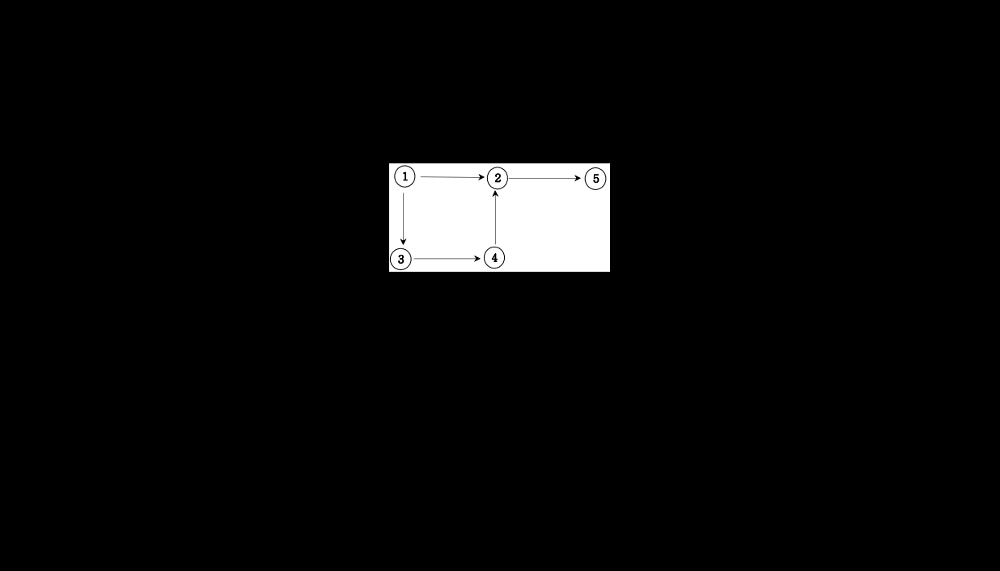
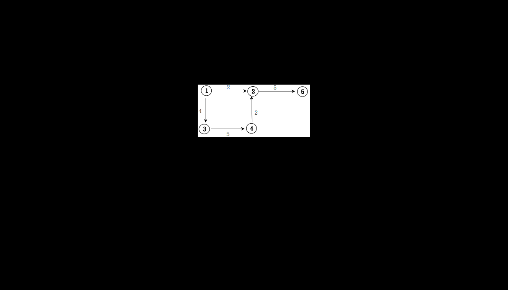
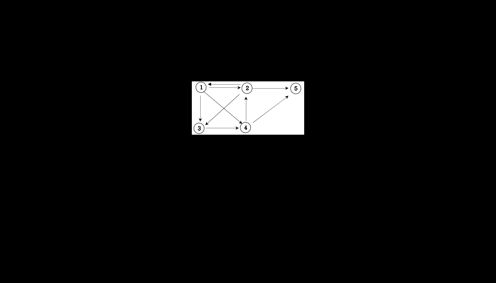

# 7&#46; Recursive and Tree and Graph(DFS, BFS basic)

<!--more-->
<!-- Table of contents -->
* this unordered seed list will be replaced by the toc
{:toc}

## 1. 재귀함수
  
자연수 N이 입력되면 재귀함수를 이용하여 1부터 N까지를 출력하는 프로그램을 작성하세요.  
  
▣ 입력설명  
첫 번째 줄은 정수 N(3<=N<=10)이 입력된다.  
  
▣ 출력설명  
첫째 줄에 출력한다.  
  
▣ 입력예제 1  
3  
  
▣ 출력예제 1  
1 2 3  

``` java
import java.util.*;
class Main {
	public void DFS(int n){
		if(n==0) return;
		else{
			DFS(n-1);
			System.out.print(n+" ");
		}
	}

	public void solution(int n){
		DFS(n);
	}
	public static void main(String[] args){
		Main T = new Main();
		T.solution(3);
		//System.out.println(T.solution(3));
	}	
}
```

## 2. 재귀함수를 이용한 이진수 출력
  
10진수 N이 입력되면 2진수로 변환하여 출력하는 프로그램을 작성하세요. 단 재귀함수를 이용해서 출력해야 합니다.  
  
▣ 입력설명  
첫 번째 줄에 10진수 N(1<=N<=1,000)이 주어집니다.  
  
▣ 출력설명  
첫 번째 줄에 이진수를 출력하세요.  
  
▣ 입력예제 1  
11  
  
▣ 출력예제 1  
1011  

``` java
import java.util.*;
class Main {
	public void DFS(int n){
		if(n==0) return;
		else{
			DFS(n/2);
			System.out.print(n%2);
		}
	}

	public void solution(int n){
		DFS(n);
	}
	public static void main(String[] args){
		Main T = new Main();
		T.solution(11);
		//System.out.println(T.solution(3));
	}	
}
```

## 3. 팩토리얼
  
자연수 N이 입력되면 N!를 구하는 프로그램을 작성하세요.  
예를 들어 5! = 5*4*3*2*1=120입니다.  
  
▣ 입력설명  
첫 번째 줄에 자연수 N(1<=N<=10)이 주어집니다.  
  
▣ 출력설명  
첫 번째 줄에 N팩토리얼 값을 출력합니다.  
  
▣ 입력예제 1  
5  
  
▣ 출력예제 1  
120  

``` java
import java.util.*;
class Main {
	public int DFS(int n){
		if(n==1) return 1;
		else return n*DFS(n-1);
	}
	public static void main(String[] args){
		Main T = new Main();
		System.out.println(T.DFS(5));
	}	
}
```

## 4. 피보나치 수열
  
1) 피보나키 수열을 출력한다. 피보나치 수열이란 앞의 2개의 수를 합하여 다음 숫자가 되는 수열이다.  
2) 입력은 피보나치 수열의 총 항의 수 이다. 만약 7이 입력되면 1 1 2 3 5 8 13을 출력하면 된다.  
  
▣ 입력설명  
첫 줄에 총 항수 N(3<=N<=45)이 입력된다.  
  
▣ 출력설명  
첫 줄에 피보나치 수열을 출력합니다.  
  
▣ 입력예제 1  
10  
  
▣ 출력예제 1  
1 1 2 3 5 8 13 21 34 55  

``` java
import java.util.*;
class Main {
	public int DFS(int n){
		if(n==1) return 1;
		else if(n==2) return 1;
		else return DFS(n-2)+DFS(n-1);
	}
	public static void main(String[] args){
		Main T = new Main();
		int n=10;
		for(int i=1; i<=n; i++) System.out.print(T.DFS(i)+" ");
	}	
}


import java.util.*;
class Main {
	static int[] fibo;
	public int DFS(int n){
		if(fibo[n]>0) return fibo[n];
		if(n==1) return fibo[n]=1;
		else if(n==2) return fibo[n]=1;
		else return fibo[n]=DFS(n-2)+DFS(n-1);
	}
	public static void main(String[] args){
		Main T = new Main();
		int n=45;
		fibo=new int[n+1];
		T.DFS(n);
		for(int i=1; i<=n; i++) System.out.print(fibo[i]+" ");
	}	
}
```

## 5. 이진트리 순회(깊이우선탐색)
  
아래 그림과 같은 이진트리를 전위순회와 후위순회를 연습해보세요.  
  
전위순회 출력 : 1 2 4 5 3 6 7  
중위순회 출력 : 4 2 5 1 6 3 7  
후위순회 출력 : 4 5 2 6 7 3 1  

``` java
import java.util.*;
class Node{ 
    int data; 
    Node lt, rt; 
    public Node(int val) { 
        data=val; 
        lt=rt=null; 
    } 
} 
  
public class Main{ 
    Node root; 
    public void DFS(Node root){ 
        if(root==null) 
            return; 
        else{
			DFS(root.lt);
			System.out.print(root.data+" ");
			DFS(root.rt);
		}
    } 
  
    public static void main(String args[]) { 
        Main tree=new Main(); 
        tree.root=new Node(1); 
        tree.root.lt=new Node(2); 
        tree.root.rt=new Node(3); 
        tree.root.lt.lt=new Node(4); 
        tree.root.lt.rt=new Node(5); 
		tree.root.rt.lt=new Node(6); 
        tree.root.rt.rt=new Node(7);
        tree.DFS(tree.root); 
    } 
} 
```

## 6. 부분집합 구하기(DFS)
  
자연수 N이 주어지면 1부터 N까지의 원소를 갖는 집합의 부분집합을 모두 출력하는 프로그램을 작성하세요.  
  
▣ 입력설명  
첫 번째 줄에 자연수 N(1<=N<=10)이 주어집니다.  
  
▣ 출력설명  
첫 번째 줄부터 각 줄에 하나씩 부분집합을 아래와 출력예제와 같은 순서로 출력한다.  
단 공집합은 출력하지 않습니다.  
  
▣ 입력예제 1  
3  
  
▣ 출력예제 1  
1 2 3  
1 2  
1 3  
1  
2 3  
2  
3  

``` java
import java.util.*;
class Main {
	static int n;
	static int[] ch;
	public void DFS(int L){
		if(L==n+1){
			String tmp="";
			for(int i=1; i<=n; i++){
				if(ch[i]==1) tmp+=(i+" ");
			}
			if(tmp.length()>0) System.out.println(tmp);
		}
		else{
			ch[L]=1;
			DFS(L+1);
			ch[L]=0;
			DFS(L+1);
		}
	}

	public static void main(String[] args){
		Main T = new Main();
		n=3;
		ch=new int[n+1];
		T.DFS(1);
	}	
}

```

## 7. 이진트리 순회(넓이우선탐색 : 레벨탐색)
  
아래 그림과 같은 이진트리를 레벨탐색 연습하세요.  
  
레벨 탐색 순회 출력 : 1 2 3 4 5 6 7  
  
``` java
import java.util.*;
class Node{ 
    int data; 
    Node lt, rt; 
    public Node(int val) { 
        data=val; 
        lt=rt=null; 
    } 
} 
  
public class Main{ 
    Node root; 
    public void BFS(Node root){ 
		Queue<Node> Q=new LinkedList<>();
		Q.add(root);
		int L=0;
        while(!Q.isEmpty()){
            int len = Q.size();
			System.out.print(L+" : ");
            for(int i=0; i<len; i++){
                Node cur = Q.poll();
                System.out.print(cur.data+" ");
                if(cur.lt!=null) Q.add(cur.lt);
                if(cur.rt!=null) Q.add(cur.rt);
            }
			L++;
			System.out.println();
        }
    } 
  
    public static void main(String args[]) { 
        Main tree=new Main(); 
        tree.root=new Node(1); 
        tree.root.lt=new Node(2); 
        tree.root.rt=new Node(3); 
        tree.root.lt.lt=new Node(4); 
        tree.root.lt.rt=new Node(5); 
		tree.root.rt.lt=new Node(6); 
        tree.root.rt.rt=new Node(7);
        tree.BFS(tree.root); 
    } 
} 
```

## 8. 송아지 찾기(BFS : 상태트리탐색)
  
현수는 송아지를 잃어버렸다. 다행히 송아지에는 위치추적기가 달려 있다. 현수의 위치와 송아지의 위치가 수직선상의 좌표 점으로 주어지면 현수는 현재 위치에서 송아지의 위치까지 다음과 같은 방법으로 이동한다. 송아지는 움직이지 않고 제자리에 있다.  
현수는 스카이 콩콩을 타고 가는데 한 번의 점프로 앞으로 1, 뒤로 1, 앞으로 5를 이동할 수 있다. 최소 몇 번의 점프로 현수가 송아지의 위치까지 갈 수 있는지 구하는 프로그램을 작성하세요.  
  
▣ 입력설명  
첫 번째 줄에 현수의 위치 S와 송아지의 위치 E가 주어진다. 직선의 좌표 점은 1부터 10,000  
까지이다.  
  
▣ 출력설명  
점프의 최소횟수를 구한다. 답은 1이상이며 반드시 존재합니다.  
  
▣ 입력예제 1  
5 14  
  
▣ 출력예제 1  
3  
  
▣ 입력예제 2  
8 3  
  
▣ 출력예제 2  
5  

``` java
import java.util.*;
class Main {
	int answer=0;
	int[] dis={1, -1, 5};
	int[] ch;
	Queue<Integer> Q = new LinkedList<>();
	public int BFS(int s, int e){
		ch=new int[10001];
		ch[s]=1;
		Q.offer(s);
		int L=0;
		while(!Q.isEmpty()){
			int len=Q.size();
			for(int i=0; i<len; i++){
				int x = Q.poll();
				for(int j=0; j<3; j++){
					int nx=x+dis[j];
					if(nx==e){
						return L+1;
					}
					if(nx>=1 && nx<=10000 && ch[nx]==0){
						ch[nx]=1;
						Q.offer(nx);
					}
				}
			}
			L++;
		}
		return 0;
	}

	public static void main(String[] args){
		Main T = new Main();
		Scanner kb = new Scanner(System.in);
		int s=kb.nextInt();
		int e=kb.nextInt();
		System.out.println(T.BFS(s, e));
	}	
}
```

## 9. Tree 말단 노드까지의 가장 짧은 경로(DFS)
  
아래 그림과 같은 이진트리에서 루트 노드 1에서 말단노드까지의 길이 중 가장 짧은 길이를 구하는 프로그램을 작성하세요.  
각 경로의 길이는 루트노드에서 말단노드까지 가는데 이동하는 횟수를 즉 간선(에지)의 개수를 길이로 하겠습니다.  
  
  
  
가장 짧은 길이는 3번 노느까지의 길이인 1이다.  

``` java
import java.util.*;
class Node{ 
    int data; 
    Node lt, rt; 
    public Node(int val) { 
        data=val; 
        lt=rt=null; 
    } 
} 
  
public class Main{ 
    Node root; 
    public int DFS(int L, Node root){ 
        if(root.lt==null && root.rt==null) return L;
		else return Math.min(DFS(L+1, root.lt), DFS(L+1, root.rt));
    } 
  
    public static void main(String args[]) { 
        Main tree=new Main(); 
        tree.root=new Node(1); 
        tree.root.lt=new Node(2); 
        tree.root.rt=new Node(3); 
        tree.root.lt.lt=new Node(4); 
        tree.root.lt.rt=new Node(5); 
        System.out.println(tree.DFS(0, tree.root)); 
    } 
} 
```

## 10. Tree 말단 노드까지의 가장 짧은 경로(BFS)
  
아래 그림과 같은 이진트리에서 루트 노드 1에서 말단노드까지의 길이 중 가장 짧은 길이를 구하는 프로그램을 작성하세요.  
각 경로의 길이는 루트노드에서 말단노드까지 가는데 이동하는 횟수를 즉 간선(에지)의 개수를 길이로 하겠습니다.  
  
  
  
가장 짧은 길이는 3번 노느까지의 길이인 1이다.  

``` java
import java.util.*;
class Node{ 
    int data; 
    Node lt, rt; 
    public Node(int val) { 
        data=val; 
        lt=rt=null; 
    } 
} 
  
public class Main{ 
    Node root; 
	public int BFS(Node root){ 
		Queue<Node> Q=new LinkedList<>();
		Q.offer(root);
		int L=0;
		while(!Q.isEmpty()){
			int len=Q.size();
			for(int i=0; i<len; i++){
				Node cur=Q.poll();
				if(cur.lt==null && cur.rt==null) return L;
				if(cur.lt!=null) Q.offer(cur.lt);
				if(cur.rt!=null) Q.offer(cur.rt);
			}
			L++;
		}
		return 0;
    } 
  
    public static void main(String args[]) { 
        Main tree=new Main(); 
        tree.root=new Node(1); 
        tree.root.lt=new Node(2); 
        tree.root.rt=new Node(3); 
        tree.root.lt.lt=new Node(4); 
        tree.root.lt.rt=new Node(5); 
        System.out.println(tree.BFS(tree.root)); 
    } 
} 
```

## 11. 그래프와 인접행렬
  
1. 무방향 그래프  
  
2. 방향그래프  
  
3. 가중치 방향그래프  
  
  
## 12. 경로 탐색(인접행렬)
  
방향그래프가 주어지면 1번 정점에서 N번 정점으로 가는 모든 경로의 가지 수를 출력하는 프로그램을 작성하세요. 아래 그래프에서 1번 정점에서 5번 정점으로 가는 가지 수는  
  
  
1 2 3 4 5  
1 2 5  
1 3 4 2 5  
1 3 4 5  
1 4 2 5  
1 4 5  
총 6 가지입니다.  
  
▣ 입력설명  
첫째 줄에는 정점의 수 N(1<=N<=20)와 간선의 수 M가 주어진다. 그 다음부터 M줄에 걸쳐 연결정보가 주어진다.  
  
▣ 출력설명  
총 가지수를 출력한다.  
  
▣ 입력예제 1  
5 9  
1 2  
1 3  
1 4  
2 1  
2 3  
2 5  
3 4  
4 2  
4 5  
  
▣ 출력예제 1  
6  

``` java
import java.util.*;
class Main {
	static int n, m, answer=0;
	static int[][] graph;
	static int[] ch;
	public void DFS(int v){
		if(v==n) answer++;
		else{
			for(int i=1; i<=n; i++){
				if(graph[v][i]==1 && ch[i]==0){
					ch[i]=1;
					DFS(i);
					ch[i]=0;
				}
			}
		}
	}
	
	public static void main(String[] args){
		Main T = new Main();
		Scanner kb = new Scanner(System.in);
		n=kb.nextInt();
		m=kb.nextInt();
		graph=new int[n+1][n+1];
		ch=new int[n+1];
		for(int i=0; i<m; i++){
			int a=kb.nextInt();
			int b=kb.nextInt();
			graph[a][b]=1;
		}
		ch[1]=1;
		T.DFS(1);
		System.out.println(answer);
	}	
}
```

## 13. 경로 탐색(인접리스트)
  
방향그래프가 주어지면 1번 정점에서 N번 정점으로 가는 모든 경로의 가지 수를 출력하는 프로그램을 작성하세요. 아래 그래프에서 1번 정점에서 5번 정점으로 가는 가지 수는  
  
  
  
1 2 3 4 5  
1 2 5  
1 3 4 2 5  
1 3 4 5  
1 4 2 5  
1 4 5  
  
총 6 가지입니다.  
  
  
▣ 입력설명  
첫째 줄에는 정점의 수 N(1<=N<=20)와 간선의 수 M가 주어진다. 그 다음부터 M줄에 걸쳐 연결정보가 주어진다.  
  
▣ 출력설명  
총 가지수를 출력한다.  
  
▣ 입력예제 1  
5 9  
1 2  
1 3  
1 4  
2 1  
2 3  
2 5  
3 4  
4 2  
4 5  
  
▣ 출력예제 1  
6  
  
``` java
import java.util.*;
class Main {
	static int n, m, answer=0;
	static ArrayList<ArrayList<Integer>> graph;
	static int[] ch;
	public void DFS(int v){
		if(v==n) answer++;
		else{
			for(int nv : graph.get(v)){
				if(ch[nv]==0){
					ch[nv]=1;
					DFS(nv);
					ch[nv]=0;
				}
			}
		}
	}
	
	public static void main(String[] args){
		Main T = new Main();
		Scanner kb = new Scanner(System.in);
		n=kb.nextInt();
		m=kb.nextInt();
		graph = new ArrayList<ArrayList<Integer>>();
		for(int i=0; i<=n; i++){
			graph.add(new ArrayList<Integer>());
		}
		ch=new int[n+1];
		for(int i=0; i<m; i++){
			int a=kb.nextInt();
			int b=kb.nextInt();
			graph.get(a).add(b);
		}
		ch[1]=1;
		T.DFS(1);
		System.out.println(answer);
	}	
}
```

## 14. 그래프 최단거리(BFS)
  
다음 그래프에서 1번 정점에서 각 정점으로 가는 최소 이동 간선수를 출력하세요.  
  
  
  
▣ 입력설명  
첫째 줄에는 정점의 수 N(1<=N<=20)와 간선의 수 M가 주어진다. 그 다음부터 M줄에 걸쳐 연결정보가 주어진다.  
  
▣ 출력설명  
1번 정점에서 각 정점으로 가는 최소 간선수를 2번 정점부터 차례대로 출력하세요.  
  
▣ 입력예제 1  
6 9  
1 3  
1 4  
2 1  
2 5  
3 4  
4 5  
4 6  
6 2  
6 5  
  
▣ 출력예제 1  
2 : 3  
3 : 1  
4 : 1  
5 : 2  
6 : 2  

``` java
import java.util.*;
class Main {
	static int n, m, answer=0;
	static ArrayList<ArrayList<Integer>> graph;
	static int[] ch, dis;
	public void BFS(int v){
		ch[v]=1;
		dis[v]=0;
		Queue<Integer> queue=new LinkedList<>();
		queue.offer(v);
		while(!queue.isEmpty()){
			int cv=queue.poll();
			for(int nv : graph.get(cv)){
				if(ch[nv]==0){
					ch[nv]=1;
					queue.offer(nv);
					dis[nv]=dis[cv]+1;
				}
			}
		}
	}
	
	public static void main(String[] args){
		Main T = new Main();
		Scanner kb = new Scanner(System.in);
		n=kb.nextInt();
		m=kb.nextInt();
		graph=new ArrayList<ArrayList<Integer>>();
		for(int i=0; i<=n; i++){
			graph.add(new ArrayList<Integer>());
		}
		ch=new int[n+1];
		dis=new int[n+1];
		for(int i=0; i<m; i++){
			int a=kb.nextInt();
			int b=kb.nextInt();
			graph.get(a).add(b);
		}
		T.BFS(1);
		for(int i=2; i<=n; i++){
			System.out.println(i+" : "+dis[i]);
		}
	}	
}
```