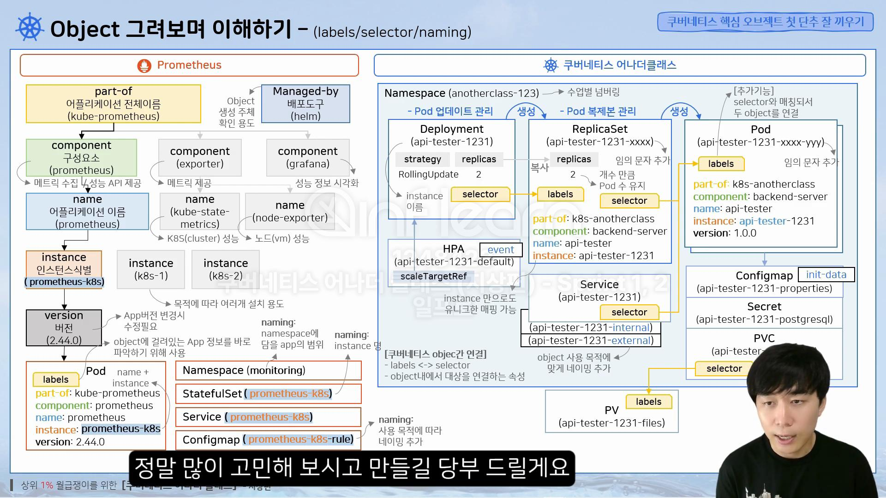
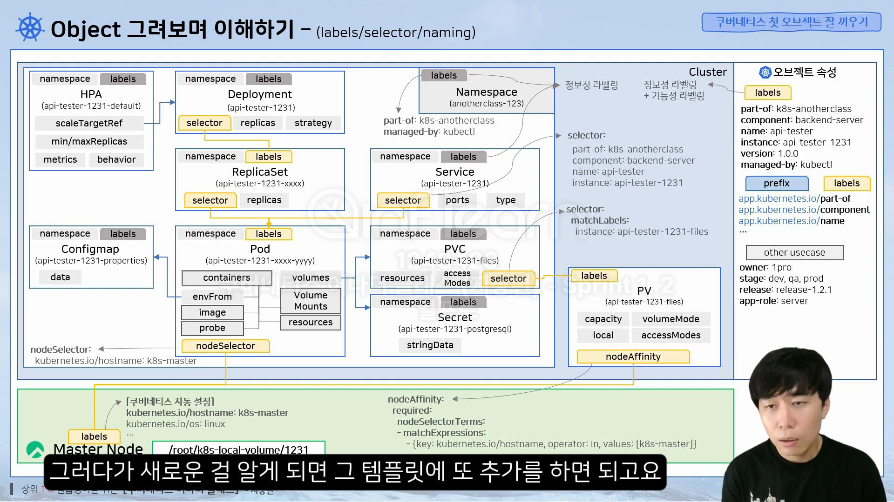

# [Kubernetes] Kubernetes 설치

<!--more-->
<!-- Table of contents -->
* this unordered seed list will be replaced by the toc
{:toc}

<!-- text -->

## 쿠버네티스 설치하기 (마스터, 워커)
> kubeadm를 통해 설치 하는 방법을 알아본다. 쿠버네티스 설치는 한글화가 잘 되어 있으므로, 사이트에서 확인을 하며 설치를 진행해 본다.

[kubeadm 설치 url](https://kubernetes.io/ko/docs/setup/production-environment/tools/kubeadm/install-kubeadm/)

### 설치 스팩 확인
- 2GB 이상의 램, 2 이상의 CPU

### 쿠버네티스 설치 (마스터, 워커)
- 리눅스 기본 설정 : 패키지 업데이트, 타임존 설정(Asia/Seoul)
- kubeadm 설치 전 사전작업 : 방화벽 해체, 스왑 비활성화(메모리)
- 컨테이너 런타임 설치
  - 컨테이너 런타임 설치 전 사전작업 : iptables 세팅(네트워크)
  - 컨테이너 런타임(containerd 설치)
    - dontainerd 패키지 설치
      - docker engin 설치 : repo 설치, containerd 설치
  - 컨테이너 런타임 : cri 활성화
- kubeadm 설치 : repo 설정, SELinux 설정(보안), kubelet, kubeadm, kubectl 패키지 설치

### 쿠버네티스 설치 (마스터)
- kubeadm으로 클러스터 생성
  1) 클러스터 초기화
  2) kubectkl 사용 설정
  3) CNI Plugin 설치(calico)
  4) Master에 Pod를 생성 할 수 있도록 설정
- 쿠버네티스 편의 기능 설치
  1) kubectl 자동완성 기능
  2) Dashboard 설치
  3) Metrics Server 설치

웬만하면 LTS 버전을 설치 하자
그리고 호환성 확인을 해야 한다.
calico는 네트워크를 관리 한다. 
iptables는 네트워크가 들어오면 지나가는 통로
그래서 대시보드를 설치하면 iptables> calico 를 지나 대시보드로 들어가게 된다.
cni는 네트워크 통신을 위한 것

마스터엔 유저가 만든 노드가 올라가지 않는게 정석

kubectl은 탭을 통한 자동명령어를 제공한다.
메트릭스 서버는 대시보드를 도와 이쁘게 그래프로 보여준다.
kubeapi

복습 방법 자료실 빠른설치를 진행 > 설치 구간별 상태 확인 > 

pod의 labels는 어떤 종류인건지 확인을 할 수 있다.
namespace의 이름은 담을 app의 범위를 포함한 이름으로 정하는게 좋다.

