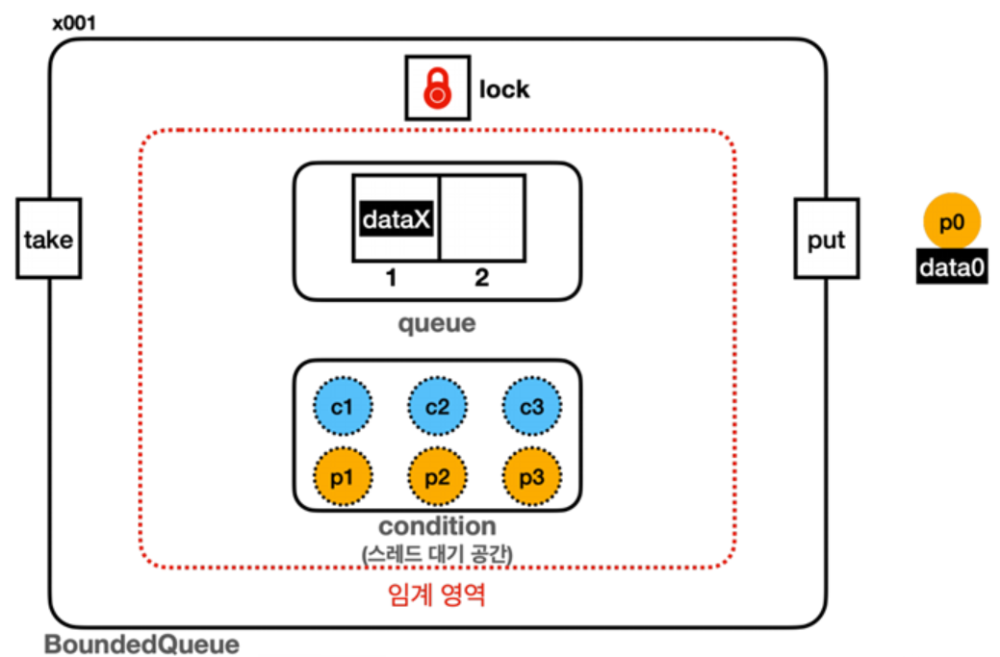

# JVM 메모리 구조

<!--more-->
<!-- Table of contents -->
* this unordered seed list will be replaced by the toc
{:toc}

<!-- text -->

## JVM 런타임 데이터 영역

| 영역명                                  |역할 및 특징| 공유 여부      |
|--------------------------------------|---|------------|
| 1. 메소드 영역 (Method Area)              |클래스 정보, 메서드 코드, 상수 풀, static 변수 등을 저장| 모든 쓰레드 공유  |
 | 2. 힙 (Heap)                          |객체 인스턴스와 배열이 저장되는 영역| 모든 쓰레드 공유  |
 | 3. JVM Stack (스택)                    |메서드별 호출 스택, 지역 변수, 연산 중간 결과 저장| 각 쓰레드별 독립적 |
 | 4. PC 레지스터 (Program Counter)         |현재 실행 중인 JVM 명령 주소(PC)를 저장| 각 쓰레드별 독립적 |
 | 5. 네이티브 메서드 스택 (Native Method Stack) |네이티브 메서드 호출 정보 저장| 각 쓰레드별 독립적 |



### 메소드 영역
> 붕어빵처럼 메소드의 틀이 있는 영역으로 `자바8`부터 `Heap > Permanent Generation` 에서 `Native > Metaspace` 영역이 이동되었다.  
> 리플렉션이나 동적 프록시를 사용하여 런타임에 수많은 클래스를 동적으로 생성, 이로인해 OOM 오류가 발생하게 됐다. 그래서 JVM의 힙이 아닌 OS가 관리하는 네이티브 메모리 영역을 사용하게 됨.

### 힙
> NEW로 생성되는 거의 모든 객체

### PC레지스터
> 각 쓰레드마다 독립적으로 존재하며, 이정표 역할을 한다. 어디까지 실행되었는지? 어디를 실행할 건지? 현재 어디까지 실행됐는지 기록하는 용도이다.  
> 이내용은 분기 처리 및 멀티스레드 환경에 이정표 역할을 하게 된다.

### 네이티브 메서드 스택
> 자바 외의 네이티브 코드로 작성된 프로그램이 실행될때 사용한다. JNI(Java Native Interface) 메서드 호출 시 사용

```java
Thread myThread = new Thread();
myThread.start(); // 여기서 내부적으로 'start0()'라는 네이티브 메서드를 호출함
```

## GC 수거를 막는 4가지 참조
> 힙(Heap)의 객체를 놓지 않고 붙잡고 있어 삭제되지 않게 하는 주체들

- `힙 내부의 참조`: 다른 객체가 필드로 가리키고 있음
- `Java 스택의 참조`: 실행 중인 메서드의 지역 변수·파라미터
- `네이티브 스택의 참조`: JNI(C/C++ 등 외부 코드)가 사용 중
- `메서드 영역의 참조`: 정적(Static) 변수가 가리키고 있음(안죽음)

```java
class Counter {
    // [Static] 정적 변수 (전영)
    static int globalCount = 0;

    // [Non-Static] 인스턴스 변수
    int myCount = 0;
}

public class Main {
    public static void main(String[] args) {
        // 객체 2개(철수, 영희) 생성
        Counter cheolsu = new Counter();
        Counter younghee = new Counter();

        // 1. 철수가 값을 바꿈
        cheolsu.globalCount++; // 전역 변수 +1
        cheolsu.myCount++;     // 내 변수 +1

        // 2. 영희가 값을 확인해봄
        System.out.println("영희의 전역 변수 값: " + younghee.globalCount); 
        // 결과: 1

        System.out.println("영희의 내 변수 값: " + younghee.myCount);     
        // 결과: 0
    }
}
```

## int와(원시형) Integer(참조형)
> Integer는 자주 사용하는 숫자들은(-127 ~ 128) 자바에서 자동으로 캐싱 된다. 범위 밖은 새 객체가 힙에 생성된다.   
> 때문에, 단순히 숫자를 계산하는 용도라면 `int`를 사용하고, 꼭 필요할 때만 `Integer`를 쓰는 것이 좋다.  
> 원시형은 스택 영역에 값이 직접 저장 된다. 메모리 크키 또한 작다.

- int는 4 byte
- Integer는 16~24 byte(객체 헤더, 포인터, 내부 int value 포함)

## String
> `String` 리터럴은 JVM의 같은 객체를 참조하는 불변 객체이다.(메모리 사용과 비교 비용을 줄이기 위함)  
> 리터럴은 `String` `s` `=` `"hello";` 처럼 `""`로 생성되는 `String` 객체이다.  
> 리터럴은 `String constant pool` `상수풀`에 저장되며, 공유 인스턴스로 관리하기 위한 메커니즘이다.(힙 영역에 있음)  
> 하지만 `new`로 생성한 객체의 경우 일반 힙 영역에 저장하며, 공유 인스턴스로 관리되지 않는다.  
> 특별한 이유가 없다면 `new String()`을 쓰는 것은 메모리 낭비이다.  
> `String`을 더해가는 연산이 필요할 경우 메모리 이슈가 발생 할 수 있어 `StringBuilder`를 사용을 권장하며, 동시성 고려가 필요할 경우 `StringBuffer`를 사용한다.  
> `StringBuilder`의 경우 힙 영역에 저장되며 해당 데이터를 직접 수정한다.

```java
String s1 = "hello";
String s2 = "hello";
String s3 = new String("hello");

s1 == s2 // true
s1 == s3 // false

```

## `JVM` 메모리 관련 `Option`

| 옵션 | 설명 | 적용 가능 JVM 버전 |
| :--- | :--- | :--- |
| `-Xms` | JVM 시작 시 초기 힙(Heap) 크기를 지정합니다. | 모든 버전 |
| `-Xmx` | JVM이 사용할 수 있는 최대 힙 크기를 지정합니다. | 모든 버전 |
| `-XX:+HeapDumpOnOutOfMemoryError` | `OutOfMemoryError`가 발생했을 때 힙 덤프 파일을 생성하도록 설정합니다. | JDK 1.4.2_12, 5.0_7 부터 |
| `-XX:HeapDumpPath` | `OutOfMemoryError` 발생 시 힙 덤프 파일이 생성될 경로를 지정합니다. | JDK 1.4.2_12, 5.0_7 부터 |
| `-Xoss` | 네이티브 스레드의 스택 크기를 지정합니다. (**현재 대부분의 JVM에서 무시됩니다**) | 구버전 (Java SE 6 부터 거의 사용되지 않음) |
| `-Xss` | 각 스레드의 스택 크기를 지정합니다. | 모든 버전 |
| `-XX:MetaspaceSize` | Metaspace의 초기 크기를 지정합니다. | Java 8 이상 |
| `-XX:MaxMetaspaceSize` | Metaspace의 최대 크기를 지정합니다. | Java 8 이상 |
| `-XX:PermSize` | Permanent Generation(PermGen)의 초기 크기를 지정합니다. | Java 7 이하 |
| `-XX:MaxPermSize` | Permanent Generation(PermGen)의 최대 크기를 지정합니다. | Java 7 이하 |
| `-XX:MaxDirectMemorySize` | 네이티브 메모리(Direct Memory)의 최대 크기를 지정합니다. | 모든 버전 |

## `OutOfMemory` 에러

### Heqp 영역
> `java.lang.OutOfMemoryError: Java heap space`

발생 원인  
- 대부분 Heap 메모리 부족, 너무 많은 객체 생성 또는 메모리 누수

해결 방법  
- `Heap` 사이즈 설정 : -Xmx
- WeakReference, SoftReference, PhantomReference 등을 활용하여 불필요한 객체 참조 제거 (뒤에서 설명)
- 메모리 프로파일러(JProfiler, VisualVM 등)를 사용하여 메모리 사용량을 분석

### PermGen(Permanent Generation) / Metaspace 영역
> Java7 이하 : java.lang.OutOfMemoryError: PermGen space  
> Java8 이상 : java.lang.OutOfMemoryError: Metaspace

발생 원인  
- Java7 이하 : 클래스 로딩이 너무 많거나, 동적으로 많은 클래스가 생성/언로딩되는 경우
- Java8 이상 : 기본적으로 OS 메모리를 사용하며 제한 없음, 하지만 `MaxMetaspaceSize` 설정을 할 경우 제한을 초과하거나 클래스 로더 누수가 발생 하는 경우(대부분 운영에선 `size`를 제한 한다.)

해결책
- PermGen / Metaspace 크기 설정
  - PermGen: -XX:MaxPermSize
  - Metaspace: -XX:MaxMetaspaceSize
- 클래스 로더 누수 확인
  - 웹 애플리케이션의 잦은 재배포 시 이전 버전의 클래스 로더가 해제되지 않고 남아있는 경우 발생할 수 있다. 애플리케이션 서버 설정을 확인하고 재배포 전략을 검토할 수 있다.
- 동적으로 생성되는 클래스 최적화.