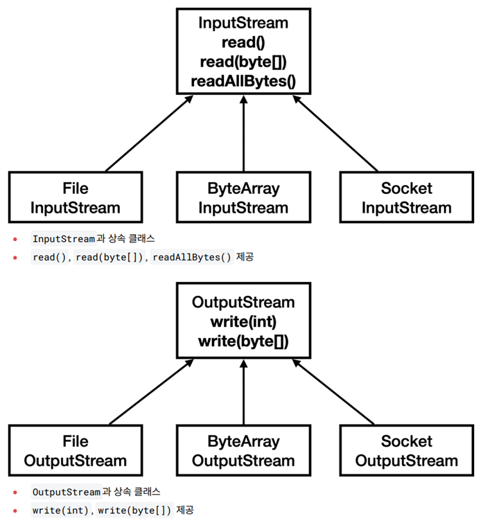

# [멀티스레드와 동시성] 스레드 제어와 생명 주기1

<!--more-->
<!-- Table of contents -->
* this unordered seed list will be replaced by the toc
{:toc}

<!-- text -->


## 스레드 기본 정보
> Thread 클래스가 제공하는 정보들을 확인해보자.

```java
  // main 스레드
  Thread mainThread = Thread.currentThread();
  log("mainThread = " + mainThread); // 스레드 ID, 스레드 이름, 우선순위, 스레드 그룹
  log("mainThread.threadId() = " + mainThread.threadId()); // 스레드의 고유 식별자(JVM 내에서 각 스레드에 대해 유일)
  log("mainThread.getName() = " + mainThread.getName()); // 스레드의 이름
  log("mainThread.getPriority() = " + mainThread.getPriority()); // 스레드의 우선순위 1(가장 낮음)~10(가장 높음) (기본값 5), 하지만 실제 실행 순서는 JVM 구현과 운영체제에 따라 달라질 수 있다.
  log("mainThread.getThreadGroup() = " + mainThread.getThreadGroup()); // 스레드가 속한 그룹을 반환. 모든 스레드는 부모 스레드와 동일한 스레드 그룹에 속하게 된다. (부모스레드는 자신을 생성한 스레드) 
  log("mainThread.getState() = " + mainThread.getState()); // 스레드의 현재 상태를 반환
  
  // myThread 스레드
  Thread myThread = new Thread(new HelloRunnable(), "myThread"); // option : 스레드의 이름을 전달할 수 있다.
  log("myThread = " + myThread);
  log("myThread.threadId() = " + myThread.threadId());
  log("myThread.getName() = " + myThread.getName()); // 위에서 지정한 스레드의 이름(myThread)
  log("myThread.getPriority() = " + myThread.getPriority());
  log("myThread.getThreadGroup() = " + myThread.getThreadGroup());
  log("myThread.getState() = " + myThread.getState());
```

실행 결과

```
//main 스레드 출력
09:55:58.709 [     main] mainThread = Thread[#1,main,5,main] 
09:55:58.713 [     main] mainThread.threadId() = 1
09:55:58.713 [     main] mainThread.getName() = main 
09:55:58.716 [     main] mainThread.getPriority() = 5 
09:55:58.716 [     main] mainThread.getThreadGroup() = 
java.lang.ThreadGroup[name=main,maxpri=10]
09:55:58.716 [     main] mainThread.getState() = RUNNABLE 
//myThread 출력
09:55:58.717 [     main] myThread = Thread[#21,myThread,5,main] 
09:55:58.717 [     main] myThread.threadId() = 21
09:55:58.717 [     main] myThread.getName() = myThread 
09:55:58.717 [     main] myThread.getPriority() = 5 
09:55:58.717 [     main] myThread.getThreadGroup() = 
java.lang.ThreadGroup[name=main,maxpri=10]
09:55:58.717 [     main] myThread.getState() = NEW
```


## 스레드의 생명 주기 - 설명


- New (새로운 상태): 스레드가 생성되었으나 아직 시작되지 않은 상태.(start() 메서드가 호출되지 않은 상태)
- Runnable (실행 가능 상태): 스레드가 실행 중이거나 실행될 준비가 된 상태.(스케줄러의 실행 대기열에 있든, CPU에서 실제 실행되고 있든 모두 RUNNABLE 상태)
- 일시 중지 상태들 (Suspended States)
  - Blocked (차단 상태): 스레드가 동기화 락을 기다리는 상태.
  - Waiting (대기 상태): 스레드가 무기한으로 다른 스레드의 작업을 기다리는 상태.(wait() , join() 메서드가 호출될 때)
  - Timed Waiting (시간 제한 대기 상태): 스레드가 일정 시간 동안 다른 스레드의 작업을 기다리는 상태.(sleep(long millis) , wait(long timeout) , join(long millis) 메서드가 호출될 때)
- Terminated (종료 상태): 스레드의 실행이 완료된 상태.

### 자바 스레드의 상태 전이 과정
1.   New → Runnable: start() 메서드를 호출하면 스레드가 Runnable 상태로 전이된다.
2.   Runnable → Blocked/Waiting/Timed Waiting: 스레드가 락을 얻지 못하거나, wait() 또는 sleep() 메서드를 호출할 때 해당 상태로 전이된다.
3.   Blocked/Waiting/Timed Waiting → Runnable: 스레드가 락을 얻거나, 기다림이 완료되면 다시 Runnable 상태로 돌아간다.
4.   Runnable → Terminated: 스레드의 run() 메서드가 완료되면 스레드는 Terminated 상태가 된다.


## 스레드의 생명 주기 - 코드

```java
public class ThreadStateMain {
    public static void main(String[] args) throws InterruptedException {
        Thread thread = new Thread(new MyRunnable(), "myThread");
        log("myThread.state1 = " + thread.getState()); // NEW 
        log("myThread.start()");
        thread.start();
        Thread.sleep(1000);
        log("myThread.state3 = " + thread.getState()); // TIMED_WAITING 
        Thread.sleep(4000);
        log("myThread.state5 = " + thread.getState()); // TERMINATED 
        log("end");
    }

    static class MyRunnable implements Runnable {
        @Override
        public void run() {
            try {
                log("start");
                log("myThread.state2 = " + Thread.currentThread().getState()); // RUNNABLE
                log("sleep() start");
                Thread.sleep(3000);
                log("sleep() end");
                log("myThread.state4 = " + Thread.currentThread().getState()); // RUNNABLE
                log("end");
            } catch (InterruptedException e) {
                throw new RuntimeException(e);
            }
        }
    }
}
```

## 체크 예외 재정의
> Runnable 인터페이스의 run() 메서드를 구현할 때 InterruptedException 체크 예외를 밖으로 던질 수 없는 이유를 알아보자.  

자바에서 메서드를 재정의 할 때, 재정의 메서드가 지켜야할 예외와 관련된 규칙이 있다.

- 체크 예외
  - 부모 메서드가 체크 예외를 던지지 않는 경우, 재정의된 자식 메서드도 체크 예외를 던질 수 없다.
  - 자식 메서드는 부모 메서드가 던질 수 있는 체크 예외의 하위 타입만 던질 수 있다.
- 언체크(런타임) 예외
  - 예외 처리를 강제하지 않으므로 상관없이 던질 수 있다.


자바는 왜 이런 제약을 두는 것일까? 가장큰 이유는 처리되지 않은 채 런타임까지 전달 되는 것을 막기 위함이다. 

```java
import java.io.IOException;

class Parent {
    void doWork() {
        System.out.println("Parent working");
    }
}

class Child extends Parent {
    @Override
    void doWork() throws IOException { // 가정: 컴파일러가 허용한다고 치자
        System.out.println("Child working");
        throw new IOException("Child exception"); // 결국 컴파일에서 잡지 않고 런타임 에러가 나게 된다.
    }
}

public class Main {
    public static void main(String[] args) {
        Parent p = new Child();  // 다형성
        p.doWork();              // 컴파일러는 예외 발생 안 하는 걸로 알고 있음
    }
}

```

하지만 어차피 예외가 던져지는 거면, 굳이? 라는 의문이 들 수 있다. 핵심 차이는 **"컴파일 타임 예외 처리 보장"** 이 목적이다. 다시말해 제약이 있음으로써, 호출자가 예외를 반드시 인식하고 안전하게 작성하도록 강제할 수 있다는 점이다.

```java
// 호출자는 반드시 try-catch 하거나 throws로 던져야 한다.
try {
    p.doWork();
} catch (IOException e) {
    // 예외 처리
}

```


## join - 시작


## join - 필요한 상황


## join - sleep 사용


## join - join 사용


## join - 특정 시간 만큼만 대기

