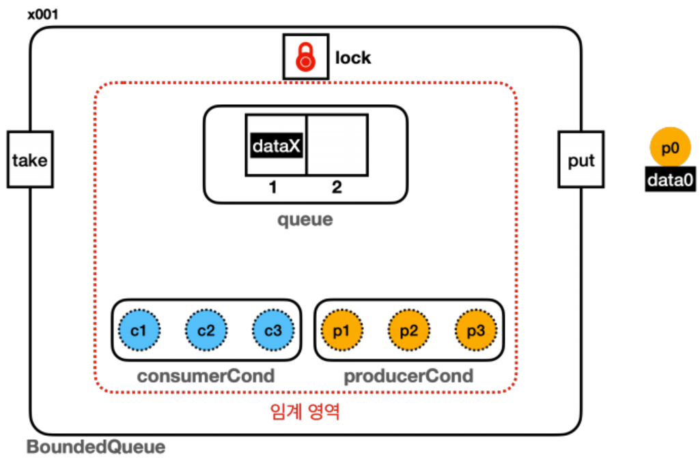
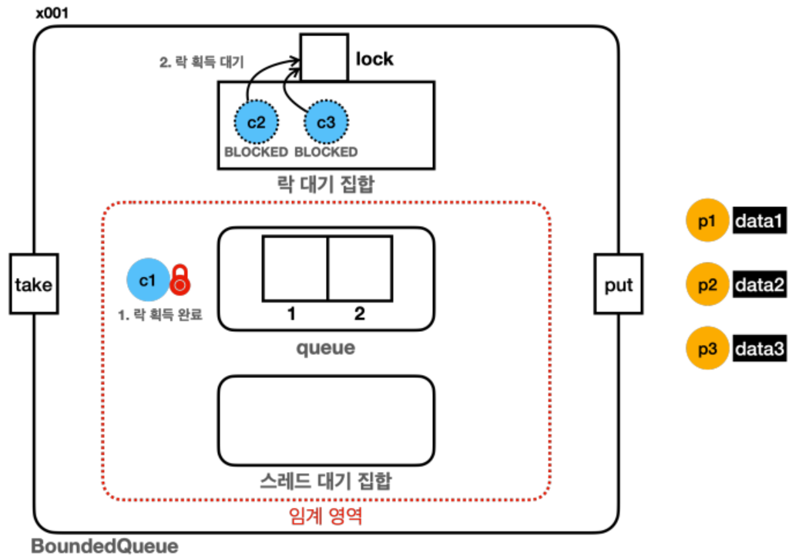
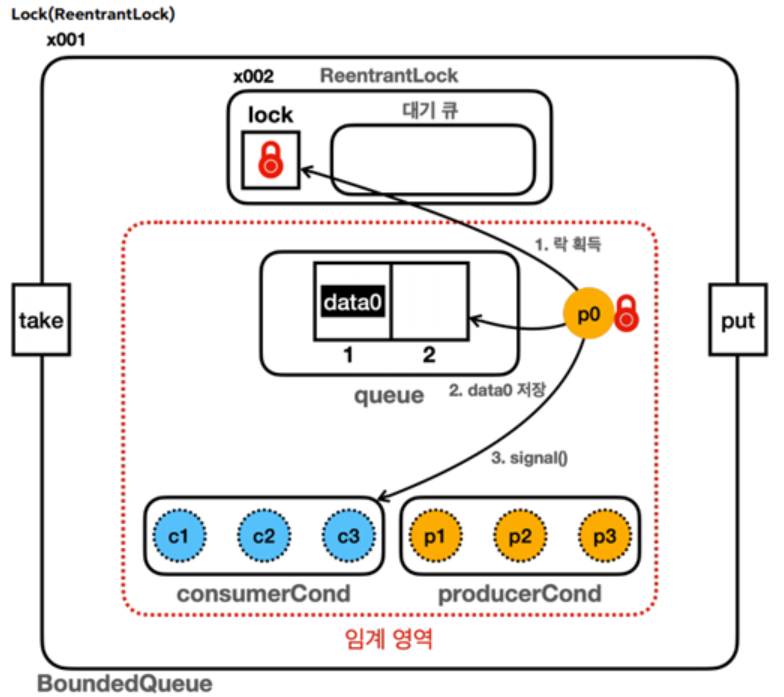

# [멀티스레드와 동시성] 생산자 소비자 문제2

<!--more-->
<!-- Table of contents -->
* this unordered seed list will be replaced by the toc
{:toc}

<!-- text -->

## 앞선 `생산자 소비자`의 문제점 개선
> 생산자나 소비자 스레드에서 `notify()`를 호출하면, 어떤 스레드가 깨어날지 예측할 수 없어 특정 스레드가 계속 기다리게 되는 '스레드 기아' 현상이 발생할 수 있다. 최악의 경우, 필요한 스레드가 깨어나지 않아 무한 루프에 빠질 수도 있다. 이러한 문제를 완화하기 위해 `notifyAll()`을 사용해 전체 스레드를 한 번에 깨워 기아 현상을 해결할 수도 있지만, 이 경우에도 불필요하게 깨어난 스레드가 다시 대기 상태로 들어가는 등의 비효율 문제는 여전히 발생할 수 있다. 이를 방지하기 위해 생산자 스레드는 소비자 스레드만 깨우고, 소비자 스레드는 생산자 스레드만 깨우도록 하는 방식으로 기아 및 비효율 문제를 동시에 해결할 수 있다.  

> 우선 하기와 같이 `Lock` 인터페이스와 `ReentrantLock`으로 코드를 변경해 준다. `synchronized` 대신에 `Lock lock = new ReentrantLock` 을 사용한다.

```java
public class BoundedQueueV4 implements BoundedQueue {
    private final Lock lock = new ReentrantLock();
    private final Condition condition = lock.newCondition();
    private final Queue<String> queue = new ArrayDeque<>();
    private final int max;

    public BoundedQueueV4(int max) {
        this.max = max;
    }

    public void put(String data) {
        lock.lock();
        try {
            while (queue.size() == max) {
                log("[put] 큐가 가득 참, 생산자 대기");
                try {
                    condition.await();
                    log("[put] 생산자 깨어남");
                } catch (InterruptedException e) {
                    throw new RuntimeException(e);
                }
            }
            queue.offer(data);
            log("[put] 생산자 데이터 저장, signal() 호출");
            condition.signal();
        } finally {
            lock.unlock();
        }
    }

    public String take() {
        lock.lock();
        try {
            while (queue.isEmpty()) {
                log("[take] 큐에 데이터가 없음, 소비자 대기");
                try {
                    condition.await();
                    log("[take] 소비자 깨어남");
                } catch (InterruptedException e) {
                    throw new RuntimeException(e);
                }
            }
            String data = queue.poll();
            log("[take] 소비자 데이터 획득, signal() 호출");
            condition.signal();
            return data;
        } finally {
            lock.unlock();
        }
    }

    @Override
    public String toString() {
        return queue.toString();
    }
}
```

### Condition
> Condition 은 ReentrantLock 을 사용하는 스레드가 대기하는 스레드 대기 공간이다. `Lock(ReentrantLock)` 을 사용하는 경우 이렇게 스레드 대기 공간을 직접 만들어서 사용해야 한다.

- `condition.await()` : `Object.wait()` 와 유사한 기능이다. 지정한 `condition` 에 현재 스레드를 `대기( WAITING )` 상태로 보관한다.
- `condition.signal()` : `Object.notify()` 와 유사한 기능이다. 지정한 `condition` 에서 대기중인 스레드를 하나 깨운다. 깨어난 스레드는 `condition` 에서 빠져나온다.


> `ReentrantLock` 은 내부에 `락`과, `락` 획득을 대기하는 스레드를 관리하는 `대기 큐(condition 영역)`가 있다.  


## 스레드 대기 공간 분리
> `lock.newCondition()`를 활용해 `스레드 대기공간(Condition)`을 2개 만들어 준다.




```java
public class BoundedQueueV5 implements BoundedQueue {
    private final Lock lock = new ReentrantLock();
    private final Condition producerCond = lock.newCondition();
    private final Condition consumerCond = lock.newCondition();
    private final Queue<String> queue = new ArrayDeque<>();
    private final int max;

    public BoundedQueueV5(int max) {

        this.max = max;
    }

    @Override
    public void put(String data) {
        lock.lock();
        try {
            while (queue.size() == max) {
                log("[put] 큐가 가득 참, 생산자 대기");
                try {
                    producerCond.await();
                    log("[put] 생산자 깨어남");
                } catch (InterruptedException e) {
                    throw new RuntimeException(e);
                }
            }
            queue.offer(data);
            log("[put] 생산자 데이터 저장, consumerCond.signal() 호출");
            consumerCond.signal(); // 데이터를 저장한 경우: 생산자가 데이터를 생산하면 큐에 데이터가 추가된다. 따라서 소비자를 깨우는 것이 좋다.
        } finally {
            lock.unlock();
        }
    }

    @Override
    public String take() {
        lock.lock();
        try {
            while (queue.isEmpty()) {
                log("[take] 큐에 데이터가 없음, 소비자 대기");
                try {
                    consumerCond.await();
                    log("[take] 소비자 깨어남");
                } catch (InterruptedException e) {
                    throw new RuntimeException(e);
                }
            }
            String data = queue.poll();
            log("[take] 소비자 데이터 획득, producerCond.signal() 호출");
            producerCond.signal(); // 데이터를 소비한 경우: 소비자가 데이터를 소비한 경우 큐에 여유 공간이 생긴다. 따라서 생산자를 깨우는 것이 좋다.
            return data;
        } finally {

            lock.unlock();
        }
    }

    @Override
    public String toString() {
        return queue.toString();
    }
}
```

실행 결과 - BoundedQueueV5, 생산자 먼저 실행
> 처음 코드 순서에 따라 생산자 그룹이 먼저 활동을 시작하지만, 대기 이후 `소비자`는 `생산자`를, `생산자`는 `소비자`를 깨우는걸 볼 수 있다. 
```
15:17:42.903 [     main] == [생산자 먼저 실행] 시작, BoundedQueueV5 ==
15:17:42.905 [     main] 생산자 시작
15:17:42.909 [producer1] [생산 시도] data1 -> []
15:17:42.909 [producer1] [put] 생산자 데이터 저장, consumerCond.signal() 호출
15:17:42.910 [producer1] [생산 완료] data1 -> [data1]
15:17:43.012 [producer2] [생산 시도] data2 -> [data1]
15:17:43.012 [producer2] [put] 생산자 데이터 저장, consumerCond.signal() 호출
15:17:43.012 [producer2] [생산 완료] data2 -> [data1, data2]
15:17:43.117 [producer3] [생산 시도] data3 -> [data1, data2]
15:17:43.117 [producer3] [put] 큐가 가득 참, 생산자 대기
15:17:43.223 [     main] 현재 상태 출력, 큐 데이터: [data1, data2]
15:17:43.223 [     main] producer1: TERMINATED
15:17:43.223 [     main] producer2: TERMINATED
15:17:43.223 [     main] producer3: WAITING
15:17:43.223 [     main] 소비자 시작
15:17:43.224 [consumer1] [소비 시도]     ? <- [data1, data2]
15:17:43.224 [consumer1] [take] 소비자 데이터 획득, producerCond.signal() 호출
15:17:43.224 [producer3] [put] 생산자 깨어남
15:17:43.224 [producer3] [put] 생산자 데이터 저장, consumerCond.signal() 호출
15:17:43.224 [consumer1] [소비 완료] data1 <- [data2]
15:17:43.224 [producer3] [생산 완료] data3 -> [data2, data3]
15:17:43.328 [consumer2] [소비 시도]     ? <- [data2, data3]
15:17:43.328 [consumer2] [take] 소비자 데이터 획득, producerCond.signal() 호출
15:17:43.328 [consumer2] [소비 완료] data2 <- [data3]
15:17:43.433 [consumer3] [소비 시도]     ? <- [data3]
15:17:43.433 [consumer3] [take] 소비자 데이터 획득, producerCond.signal() 호출
15:17:43.434 [consumer3] [소비 완료] data3 <- []
15:17:43.536 [     main] 현재 상태 출력, 큐 데이터: []
15:17:43.536 [     main] producer1: TERMINATED
15:17:43.537 [     main] producer2: TERMINATED
15:17:43.537 [     main] producer3: TERMINATED
15:17:43.537 [     main] consumer1: TERMINATED
15:17:43.537 [     main] consumer2: TERMINATED
15:17:43.538 [     main] consumer3: TERMINATED
15:17:43.538 [     main] == [생산자 먼저 실행] 종료, BoundedQueueV5 ==
```


실행 결과 - BoundedQueueV5, 소비자 먼저 실행

```
15:18:03.930 [     main] == [소비자 먼저 실행] 시작, BoundedQueueV5 ==
15:18:03.932 [     main] 소비자 시작
15:18:03.934 [consumer1] [소비 시도]     ? <- []
15:18:03.934 [consumer1] [take] 큐에 데이터가 없음, 소비자 대기
15:18:04.039 [consumer2] [소비 시도]     ? <- []
15:18:04.039 [consumer2] [take] 큐에 데이터가 없음, 소비자 대기
15:18:04.144 [consumer3] [소비 시도]     ? <- []
15:18:04.144 [consumer3] [take] 큐에 데이터가 없음, 소비자 대기
15:18:04.250 [     main] 현재 상태 출력, 큐 데이터: []
15:18:04.252 [     main] consumer1: WAITING
15:18:04.252 [     main] consumer2: WAITING
15:18:04.252 [     main] consumer3: WAITING
15:18:04.253 [     main] 생산자 시작
15:18:04.253 [producer1] [생산 시도] data1 -> []
15:18:04.253 [producer1] [put] 생산자 데이터 저장, consumerCond.signal() 호출
15:18:04.253 [consumer1] [take] 소비자 깨어남
15:18:04.254 [producer1] [생산 완료] data1 -> [data1]
15:18:04.254 [consumer1] [take] 소비자 데이터 획득, producerCond.signal() 호출
15:18:04.254 [consumer1] [소비 완료] data1 <- []
15:18:04.355 [producer2] [생산 시도] data2 -> []
15:18:04.355 [producer2] [put] 생산자 데이터 저장, consumerCond.signal() 호출
15:18:04.355 [producer2] [생산 완료] data2 -> [data2]
15:18:04.355 [consumer2] [take] 소비자 깨어남
15:18:04.356 [consumer2] [take] 소비자 데이터 획득, producerCond.signal() 호출
15:18:04.356 [consumer2] [소비 완료] data2 <- []
15:18:04.460 [producer3] [생산 시도] data3 -> []
15:18:04.460 [producer3] [put] 생산자 데이터 저장, consumerCond.signal() 호출
15:18:04.461 [consumer3] [take] 소비자 깨어남
15:18:04.461 [producer3] [생산 완료] data3 -> [data3]
15:18:04.461 [consumer3] [take] 소비자 데이터 획득, producerCond.signal() 호출
15:18:04.461 [consumer3] [소비 완료] data3 <- []
15:18:04.565 [     main] 현재 상태 출력, 큐 데이터: []
15:18:04.566 [     main] consumer1: TERMINATED
15:18:04.566 [     main] consumer2: TERMINATED
15:18:04.567 [     main] consumer3: TERMINATED
15:18:04.567 [     main] producer1: TERMINATED
15:18:04.567 [     main] producer2: TERMINATED
15:18:04.567 [     main] producer3: TERMINATED
15:18:04.568 [     main] == [소비자 먼저 실행] 종료, BoundedQueueV5 ==
```

### Object.notify() vs Condition.signal()
- `Object.notify()`
  - 대기 중인 스레드 중 임의의 하나를 선택해서 깨운다. 스레드가 깨어나는 순서는 정의되어 있지 않으며,
  - `JVM` 구현에 따라 다르다. 보통은 먼저 들어온 스레드가 먼저 수행되지만 구현에 따라 다를 수 있다.
  - `synchronized` 블록 내에서 모니터 락을 가지고 있는 스레드가 호출해야 한다.
- `Condition.signal()`
  - 대기 중인 스레드 중 하나를 깨우며, 일반적으로는 `FIFO` 순서로 깨운다. 이 부분은 자바 버전과 구현에 따
  - 라 달라질 수 있지만, 보통 `Condition` 의 구현은 `Queue` 구조를 사용하기 때문에 `FIFO` 순서로 깨운다.
  - `ReentrantLock` 을 가지고 있는 스레드가 호출해야 한다.

### 대기 집합 공간

#### synchronized
> synchronized의 경우 아래와 같이 스레드가 두 가지 상태로 대기할 수 있다. 락을 얻으려고 시도하지만 다른 스레드가 락을 보유 중이면, 스레드는 `BLOCKED` 상태로 진입하여 모니터 락 대기열에서 락이 풀리기를 기다린다.
> 한편, 락을 얻은 후 `wait()`를 호출하면 락을 반납하고 `WAITING` 상태로 들어가며, 이때 `notify()`나 `notifyAll()` 호출로 깨워진 스레드는 다시 락을 얻으려고 시도하며 `BLOCKED` 상태로 전환된다. 
> 비유를 하자면 임계 영역을 안전하게 지키기 위한 2중 감옥인 것이다. 스레드는 2중 감옥을 모두 탈출해야 임계 영역을 수행할 수 있다.



#### 멀티스레드를 위한 3가지 기본 요소
> 자바의 모든 객체 인스턴스는 멀티스레드와 임계 영역을 다루기 위해 내부에 3가지 기본 요소를 가진다.

- 모니터 락
- 락 대기 집합(모니터 락 대기 집합)
- 스레드 대기 집합

#### synchronized vs ReentrantLock 대기
> `synchronized` 와 마찬가지로 `Lock(ReentrantLock)` 도 2가지 단계의 대기 상태가 존재한다. 둘다 같은 개념을 구현한 것이기 때문에 비슷하다.



#### 2단계 대기소
> 참고로 깨어난 스레드는 바로 실행되는 것이 아니다. 락을 획득해야 `RUNNABLE` 상태가 되면서 그 다음 코드를 실행할 수 있다. `락`을 획득하지 못하면 1단계 대기소에서 대기한다.


## BlockingQueue
> `BlockingQueue`는 앞서 설명한 기능들을 이미 구현해 둔 자료구조이다.

- 데이터 추가 차단: 큐가 가득 차면 데이터 `추가 작업( put() )`을 시도하는 스레드는 공간이 생길 때까지 차단된다.
- 데이터 획득 차단: 큐가 비어 있으면 `획득 작업( take() )`을 시도하는 스레드는 큐에 데이터가 들어올 때까지 차단된다.

### BlockingQueue 인터페이스 기능 확인

- 데이터 추가 메서드: add() , offer() , put() , offer(타임아웃)
- 데이터 획득 메서드: take() , poll(타임아웃) , remove(..)
- Queue 를 상속 받는다. 큐를 상속 받았기 때문에 추가로 큐의 기능들도 사용할 수 있다.

```java
public interface BlockingQueue<E> extends Queue<E> {
    
    boolean add(E e);
    boolean offer(E e);
    void put(E e) throws InterruptedException;
    boolean offer(E e, long timeout, TimeUnit unit) throws InterruptedException;

    E take() throws InterruptedException;
    E poll(long timeout, TimeUnit unit) throws InterruptedException;
    boolean remove(Object o);
    //...
}
```

### BlockingQueue 인터페이스의 대표적인 구현체
- ArrayBlockingQueue : 배열 기반으로 구현되어 있고, 버퍼의 크기가 고정되어 있다.
- LinkedBlockingQueue : 링크 기반으로 구현되어 있고, 버퍼의 크기를 고정할 수도, 또는 무한하게 사용할 수 도 있다.
  

BlockingQueue 를 사용하도록 기존 코드를 변경해보자.

```java
public class BoundedQueueV6_1 implements BoundedQueue {
    private BlockingQueue<String> queue;

    public BoundedQueueV6_1(int max) {
        queue = new ArrayBlockingQueue<>(max);
    }

    public void put(String data) {
        try {
            queue.put(data);
        } catch (InterruptedException e) {
            throw new RuntimeException(e);
        }
    }

    public String take() {
        try {
            return queue.take();
        } catch (InterruptedException e) {
            throw new RuntimeException(e);
        }
    }

    @Override
    public String toString() {
        return queue.toString();
    }
}
```

### ArrayBlockingQueue.put()
> `ArrayBlockingQueue.put()`의 코드를 확인해보자.


