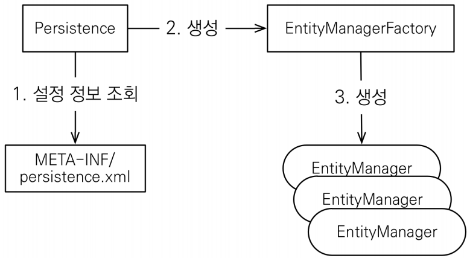
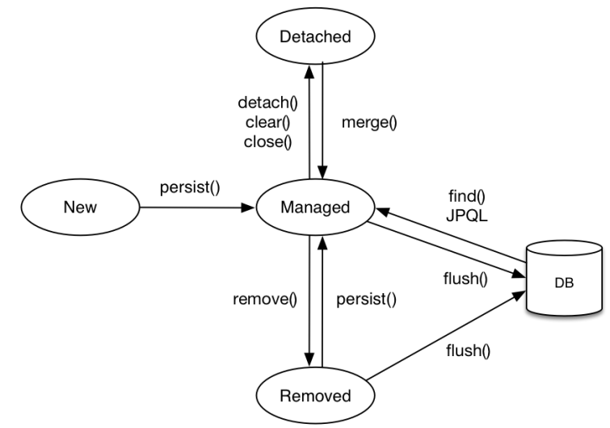

# 1. JPA 시작

<!--more-->
<!-- Table of contents -->
* this unordered seed list will be replaced by the toc
{:toc}

<!-- text -->

## JPA: 개발의 편리함을 더해주는 선택  
> 전 세계 자바 개발자들이 데이터베이스 연동할 때 MyBatis보다 JPA를 선호하는 추세가 확실해졌다. 이유는 JPA가 개발 과정에 많은 장점을 가져다주기 때문이다. 간단하게 말해서, JPA는 자바 애플리케이션에서 데이터베이스를 객체 지향적으로 쉽게 다루게 해준다. SQL 쿼리를 직접 작성할 필요 없이 데이터 관리가 가능해지며, 결과적으로 코드는 더 깔끔해지고 유지 보수도 훨씬 수월해진다.  
> 더욱이, Hibernate 같은 여러 구현체를 지원함으로써 프로젝트에 가장 적합한 도구를 선택할 수 있는 유연성을 준다. 이런 이유로 많은 개발자들이 JPA를 선택하는 것이다. 나 역시 이 기술을 깊게 파보면서 많은 것을 배웠다. JPA를 배우는 것은 계속 새로운 발견이 있는 여정이었다.
  
## 데이터베이스 방언
> JPA를 사용하면서 Dialect 기능을 통해 각 데이터베이스의 고유한 기능을 손쉽게 활용할 수 있다.  
- H2 : org.hibernate.dialect.H2Dialect 
- Oracle 10g : org.hibernate.dialect.Oracle10gDialect 
- MySQL : org.hibernate.dialect.MySQL5InnoDBDialect
- 하이버네이트는 40가지 이상의 데이터베이스 방언 지원

## JPA 구동 방식

### 주의  
- 엔티티 매니저 팩토리는 하나만 생성해서 애플리케이션 전체에 서 공유
- 엔티티 매니저는 쓰레드간에 공유X (사용하고 버려야 한다).
- JPA의 모든 데이터 변경은 트랜잭션 안에서 실행

## 영속성 컨텍스트란?
- JPA를 이해하는데 가장 중요한 용어
- “엔티티를 영구 저장하는 환경”이라는 뜻
- EntityManager.persist(entity);
- 영속성 컨텍스트는 논리적인 개념
- 눈에 보이지 않는다.
- 엔티티 매니저를 통해서 영속성 컨텍스트에 접근

## 엔티티의 생명주기
- 비영속 (new/transient) : 영속성 컨텍스트와 전혀 관계가 없는 새로운 상태
- 영속 (managed) : 영속성 컨텍스트에 관리되는 상태
- 준영속 (detached) : 영속성 컨텍스트에 저장되었다가 분리된 상태
- 삭제 (removed)  : 삭제된 상태

## 영속성 컨텍스트의 이점
- 1차 캐시
- 동일성(identity) 보장
- 트랜잭션을 지원하는 쓰기 지연 (transactional write-behind)
- 변경 감지(Dirty Checking)
- 지연 로딩(Lazy Loading)

## 플러시
> 영속성 컨텍스트의 변경내용을 데이터베이스에 반영  
> 플러시 방법 :  
> - em.flush() - 직접 호출
> - 트랜잭션 커밋 - 플러시 자동 호출
> - JPQL 쿼리 실행 - 플러시 자동 호출

### 플러시 모드 옵션
- 기본적으로 JPQL 쿼리 실행시 플러시가 자동 으로 호출 된다
- 적용 방법 : em.setFlushMode(FlushModeType.COMMIT)
- FlushModeType.AUTO : 커밋이나 쿼리를 실행할 때 플러시 (기본값)
- FlushModeType.COMMIT : 커밋할 때만 플러시

### 플러시는!
- 영속성 컨텍스트를 비우지 않음
- 영속성 컨텍스트의 변경내용을 데이터베이스에 동기화
- 트랜잭션이라는 작업 단위가 중요 -> 커밋 직전에만 동기화 하면 됨

## 준영속 상태
- 영속 -> 준영속
- 영속 상태의 엔티티가 영속성 컨텍스트에서 분리(detached)
- 영속성 컨텍스트가 제공하는 기능을 사용 못함

### 준영속 상태로 만드는 방법
- em.detach(entity) : 특정 엔티티만 준영속 상태로 전환
- em.clear() : 영속성 컨텍스트를 완전히 초기화
- em.close() : 영속성 컨텍스트를 종료

