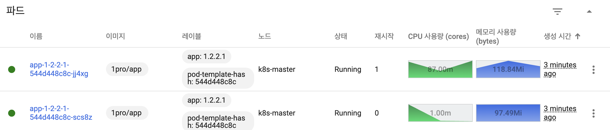
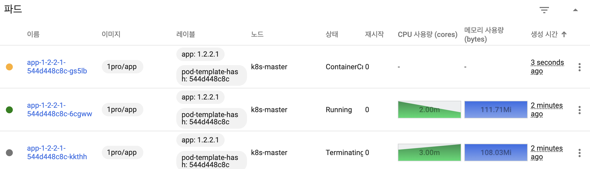
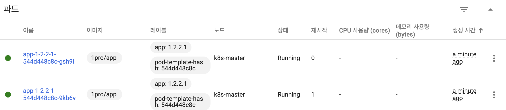
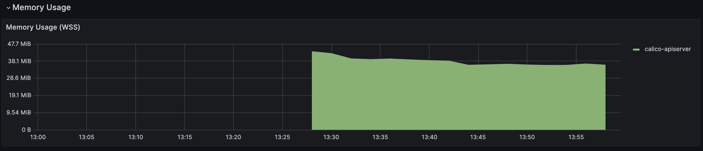
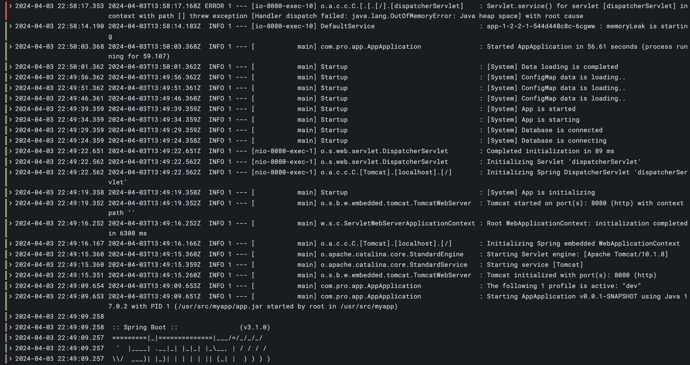
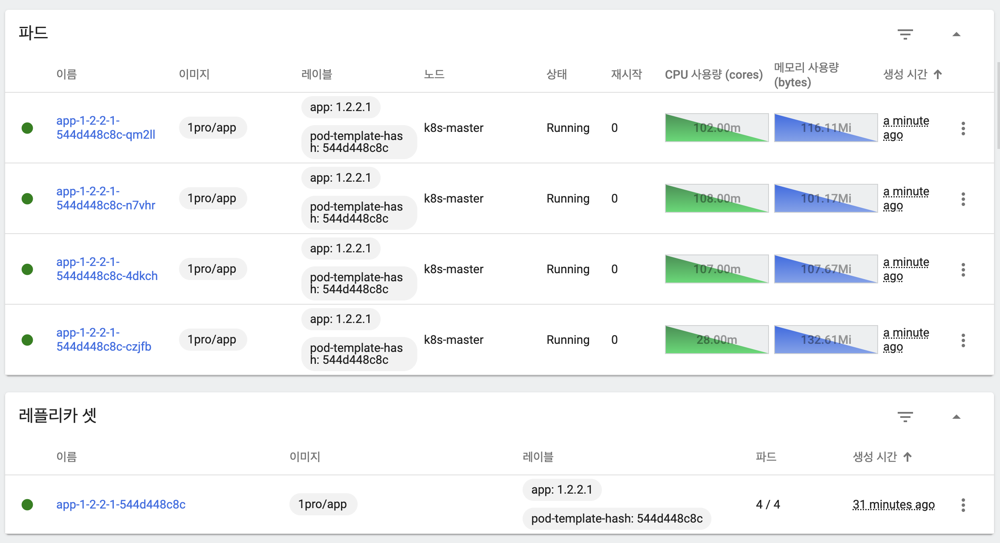

# [Kubernetes] 트래픽 테스트

<!--more-->
<!-- Table of contents -->
* this unordered seed list will be replaced by the toc
{:toc}

<!-- text -->


## 테스트 어플리케이션 생성
- 파드를 이중화한 상태
- 서비스는 자체적으로 파드가 두 개 있으면 트래픽을 두 pod로 분산
- 오토 스케일링의 경우 최소 2, 최대 4이며 CPU를 기준으로 평균 40%가 넘으면 적용

```yaml
apiVersion: apps/v1
kind: Deployment
metadata:
  name: app-1-2-2-1
spec:
  selector:
    matchLabels:
      app: '1.2.2.1'
  replicas: 2
  strategy:
    type: RollingUpdate
  template:
    metadata:
      labels:
        app: '1.2.2.1'
    spec:
      containers:
        - name: app-1-2-2-1
          image: 1pro/app
          imagePullPolicy: Always
          ports:
            - name: http
              containerPort: 8080
          startupProbe:
            httpGet:
              path: "/ready"
              port: http
            failureThreshold: 20
          livenessProbe:
            httpGet:
              path: "/ready"
              port: http
          readinessProbe:
            httpGet:
              path: "/ready"
              port: http
          resources:
            requests:
              memory: "100Mi"
              cpu: "100m"
            limits:
              memory: "200Mi"
              cpu: "200m"
---
apiVersion: v1
kind: Service
metadata:
  name: app-1-2-2-1
spec:
  selector:
    app: '1.2.2.1'
  ports:
    - port: 8080
      targetPort: 8080
      nodePort: 31221
  type: NodePort
---
apiVersion: autoscaling/v2
kind: HorizontalPodAutoscaler
metadata:
  name: app-1-2-2-1
spec:
  scaleTargetRef:
    apiVersion: apps/v1
    kind: Deployment
    name: app-1-2-2-1
  minReplicas: 2
  maxReplicas: 4
  metrics:
    - type: Resource
      resource:
        name: cpu
        target:
          type: Utilization
          averageUtilization: 40
```



## Traffic Routing
- 2초 간격으로 꾸준히 트래픽을 발생

```shell
while true; do curl http://192.168.56.30:31221/hostname; sleep 2; echo '';  done;
```



## Self-Healing
- 강제로 메모리 릭 발생
```shell
curl 192.168.56.30:31221/memory-leak
```



- 쿠버네티스에서 메모리 릭이 발생한 파드를 재시작(1)한 것을 확인할 수 있음




- 발생한 파드와 시간대를 토대로 문제 로그 확인 가능
- 로그를 통해 OOM 발생 이후 쿠버네티스가 자동으로 재시작하는 것을 확인할 수 있음

## AutoScaling

```shell
curl 192.168.56.30:31221/cpu-load
```

- 증가한 트래픽에 따라 Auto Scaling이 적용되어 파드 수가 2 -> 4개로 증가


- 트래픽이 감소하면 다시 파드 수가 4 -> 2로 감소

## RollingUpdate
- 쿠버는 기본적으로 RollingUpdate로 설정이 되어 있음
- 파드가 하나씩 생성되며, 정상 기동후 트래픽 분산 생성된 만큼 기존 파드 삭제

```shell
kubectl set image -n default deployment/app-1-2-2-1 app-1-2-2-1=1pro/app-update
```