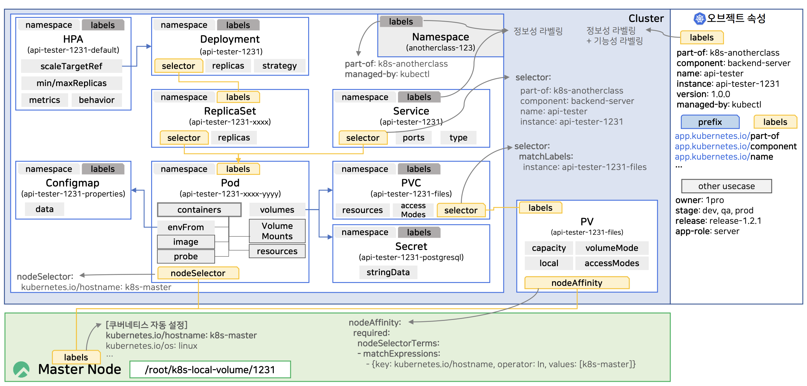
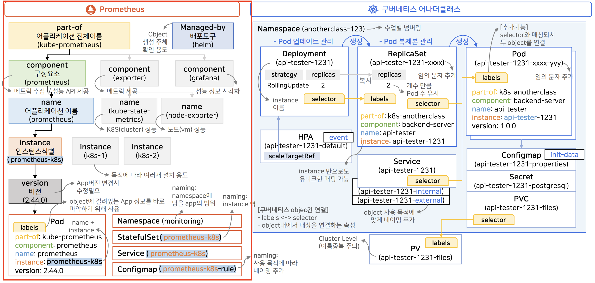
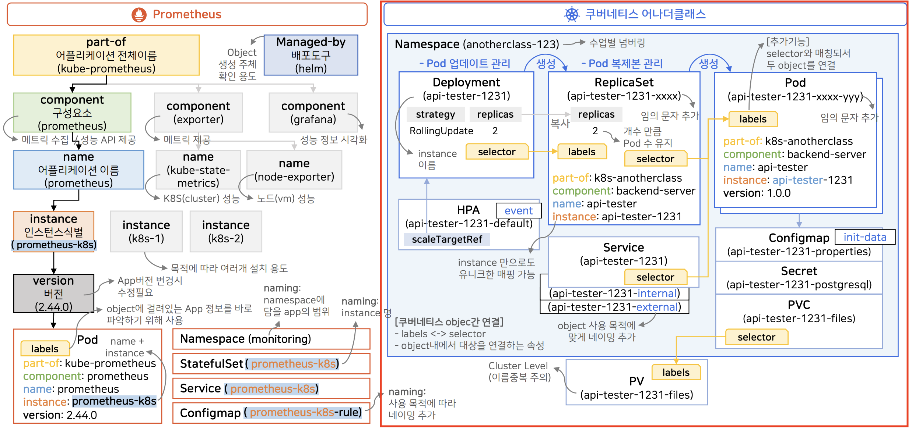

# [Kubernetes] Object 이해하기

<!--more-->
<!-- Table of contents -->
* this unordered seed list will be replaced by the toc
{:toc}

<!-- text -->


# Object



## 종류 및 설명

- Namespace
    - Namespace Level Object들을 그룹핑해주는 역할
    - 특정 Namespace에 속하는 Object의 경우 metadata.namespace에 해당 namespace의 식별자 명시
    - Namespace를 삭제하는 경우 해당 Namespace에 속한 모든 Object도 같이 삭제
- Deployment : Namespace Level Object
    - 파드 생성 및 업데이트를 수행하는 역할
    - ReplicaSet : Namespace Level Object
        - Deployment의 파드 생성 역할을 수행하기 위해 쿠버네티스 내부적으로 생성되는 Object
- Service : Namespace Level Object
    - 파드에게 트래픽을 연결시켜 주는 역할
- Configmap
    - 파드의 환경 변수 값을 제공하는 역할 : Namespace Level Object
- Secret : Namespace Level Object
    - Configmap과 유사하나, 파드에게 중요한(secret) 값을 제공하는 역할
- PVC(Persistent Volumne Claim) : Namespace Level Object
    - 파드 정의 시 PV를 지정할 때 사용
- PV(Persistent Volumn) : Cluster Level Object
    - 실제 볼륨을 지정하는 역할
- HPA
    - 부하에 따라 파드를 스케일링 하는 역할

## 관련 설정 (일부)

- Deployment
    - spec.replicas : 생성할 파드의 개수 지정
    - spec.strategy.type : 파드 업데이트 시 전략 지정
    - spec.template : 생성할 파드 설정
    - spec.template.spec.nodeSelector : 파드를 띄울 노드 선택
    - spec.template.spec.container : 파드 생성 시 사용할 컨테이너 이미지 설정
    - spec.template.spec.containers.envFrom : 애플리케이션 환경 변수 관련 설정
    - spec.template.spec.containers.startupProbe : 애플리케이션이 잘 기동되었는지 확인하는 용도
      실패 시 재기동하며, 성공 시 readinessProbe, livenessProbe 트리거
    - spec.template.spec.containers.readinessProbe : 애플리케이션에 트래픽을 연결할지 결정하는 용도
      서비스를 활성화한다는 의미이며, 이를 수행해야 외부에서 파드에 접근 가능
      실패 시 연결 해제
    - spec.template.spec.containers.livenessProbe : 애플리케이션이 정상이 아닐 경우 재시작시킬지 판단하는 속성
      실패 시 재기동
    - spec.template.spec.containers.resources : 파드에 할당할 리소스 설정
    - spec.template.spec.containers.volumeMounts : 볼륨 설정
    - spec.template.volume : volumeMounts에서 지정한 name과 연결되는 실제 Object(PVC)
- Configmap
    - data : 환경 변수로 지정된 값
      key-value 형태
- Secret
    - stringData : 지정한 key로 파일을 생성하고 파일의 내용으로는 value를 세팅
- PVC
    - spec.resources : PVC 리소스 설정
    - spec.accessModes : 읽기/쓰기 모드 설정
      필수로 지정해야 하는 값
- PV
    - spec.local.path : 지정한 path를 볼륨으로 사용
      파드 생성 전 존재해야 하는 path
    - spec.nodeAffinity : 대상 노드를 지정하는 방식
      nodeSelector와 유사
- HPA
    - spec.scaleTargetRef.kind : 트리거될 Object의 종류 지정
    - spec.minReplicas : 레플리카 최소 개수
    - spec.maxReplicas : 레플리카 최대 개수
    - spec.metrics : 파드가 스케일링 되기 위한 조건
    - spec.behavior.scaleUp.stabilizationWindowSeconds : 파드의 수가 늘어난 뒤 지정한 주기 동안은 파드가 늘어나지 않도록 제한하는 속성

## 스크립트

## Namespace

- Object들을 그룹핑해주는 역할
- Namespace Level Object

```yml
apiVersion: v1
kind: Namespace
metadata:
  name: anotherclass-123
  labels:
    part-of: k8s-anotherclass
    managed-by: dashboard
```

## Deployment

- 파드 생성 및 업데이트를 수행하는 역할
- Namespace Level Object
    - PV처럼 Cluster Level에 만들어 질 수 없음

```yml
apiVersion: apps/v1
kind: Deployment
metadata:
  # Deployment를 지정한 Namespace에 소속시킴 
  namespace: anotherclass-123
  # 하나의 Namespce 안에서 동일한 종류의 파드는 이름이 중복되어서는 안 됨
  name: api-tester-1231
  labels:
    part-of: k8s-anotherclass
    component: backend-server
    name: api-tester
    instance: api-tester-1231
    version: 1.0.0
    managed-by: dashboard
spec:
  selector:
    matchLabels:
      part-of: k8s-anotherclass
      component: backend-server
      name: api-tester
      instance: api-tester-1231
  # 두 개의 파드 생성
  replicas: 2
  # Deployment 기능의 핵심
  # 업데이트 방식 
  strategy:
    type: RollingUpdate
  # template 내용을 토대로 파드 생성 
  template:
    metadata:
      labels:
        part-of: k8s-anotherclass
        component: backend-server
        name: api-tester
        instance: api-tester-1231
        version: 1.0.0
    spec:
      # 파드를 띄울 노드 선택
      nodeSelector:
        kubernetes.io/hostname: k8s-master
      containers:
        - name: api-tester-1231
          # DockerHub에서 다운로드 받을 컨테이너 이미지 
          image: 1pro/api-tester:v1.0.0
          ports:
          - name: http
            containerPort: 8080
          # 애플리케이션 환경 변수와 관련된 설정
          envFrom:
            # key-value로 환경 변수를 제공해주는 역할 
            - configMapRef:
                name: api-tester-1231-properties
          # 애플리케이션이 잘 기동되었는지 확인하는 용도
          # 실패 시 재기동
          # 기동이 정상적으로 된 경우 readinessProbe, livenessProbe 트리거하는 속성
          startupProbe:
            httpGet:
              path: "/startup"
              port: 8080
            periodSeconds: 5
            failureThreshold: 24
          # 애플리케이션에 트래픽을 연결할지 결정하는 속성
          # 실패 시 연결 해제
          readinessProbe:
            httpGet:
              path: "/readiness"
              port: 8080
            periodSeconds: 10
            failureThreshold: 3
          # 애플리케이션이 정상이 아닌 경우 재시작시킬지 판단하는 속성
          # 실패 시 재기동
          livenessProbe:
            httpGet:
              path: "/liveness"
              port: 8080
            periodSeconds: 10
            failureThreshold: 3
          # 파드에 할당할 리소스 설정
          resources:
            # 메모리와 CPU 할당
            requests:
              memory: "100Mi"
              cpu: "100m"
            # 최대로 사용할 수 있는 메모리와 CPU 용량 
            # 설정하지 않을 시 파드가 노드의 자원을 모두 사용할 수도 있음
            limits:
              memory: "200Mi"
              cpu: "200m"
          # 볼륨 관련 속성
          volumeMounts:
            # volumeMounts의 name과 volumes의 name이 매칭됨
            - name: files
              # 파드 내부에 만들어지는 디렉토리 
              # PVC로 연결됨
              mountPath: /usr/src/myapp/files/dev
            - name: secret-datasource
              mountPath: /usr/src/myapp/datasource
      volumes:
        - name: files
          # volumeMounts에서 지정한 name과 연결되는 실제 Object
          persistentVolumeClaim:
            claimName: api-tester-1231-files
        - name: secret-datasource
          secret:
            secretName: api-tester-1231-postgresql
```

## Service

- 파드에게 트래픽을 연결시켜 주는 역할

```yml
apiVersion: v1
kind: Service
metadata:
  # Service를 지정한 Namespace에 소속시킴
  namespace: anotherclass-123
  # Deployment와 이름이 동일하지만 종류가 다른 Object이므로 허용됨
  name: api-tester-1231
  labels:
    part-of: k8s-anotherclass
    component: backend-server
    name: api-tester
    instance: api-tester-1231
    version: 1.0.0
    managed-by: dashboard
spec:
  selector:
    part-of: k8s-anotherclass
    component: backend-server
    name: api-tester
    instance: api-tester-1231
  ports:
    - port: 80
      targetPort: http
      nodePort: 31231
  type: NodePort
```

## Configmap, Secret

- Configmap
    - 파드의 환경 변수 값을 제공하는 역할
- Secret
    - Configmap과 유사하게 파드의 환경 변수 값을 제공하는 역할
    - 파드에게 중요한(secret) 값을 제공하는 역할

```yml
apiVersion: v1
kind: ConfigMap
metadata:
  namespace: anotherclass-123
  name: api-tester-1231-properties
  labels:
    part-of: k8s-anotherclass
    component: backend-server
    name: api-tester
    instance: api-tester-1231
    version: 1.0.0
    managed-by: dashboard
# 환경 변수로 지정된 값의 내용
data:
  spring_profiles_active: "dev"
  application_role: "ALL"
  postgresql_filepath: "/usr/src/myapp/datasource/postgresql-info.yaml"
---
apiVersion: v1
kind: Secret
metadata:
  namespace: anotherclass-123
  name: api-tester-1231-postgresql
  labels:
    part-of: k8s-anotherclass
    component: backend-server
    name: api-tester
    instance: api-tester-1231
    version: 1.0.0
    managed-by: dashboard
# 지정한 key로 파일을 생성하고 그 내용으로 value를 세팅
stringData:
  postgresql-info.yaml: |
    driver-class-name: "org.postgresql.Driver"
    url: "jdbc:postgresql://postgresql:5431"
    username: "dev"
    password: "dev123"
```

## PVC, PV

- PVC(Persistent Volume Claim)
    - 파드에서 PV을 지정할 때 사용
- PV(Persistent Volumn)
    - 실제 볼륨을 지정하는 역할
    - Namespace와 PV 모두 Cluster Level Object이기 때문에 Namespace 속성 값을 지정하지 않음

```yml
apiVersion: v1
kind: PersistentVolumeClaim
metadata:
  namespace: anotherclass-123
  name: api-tester-1231-files
  labels:
    part-of: k8s-anotherclass
    component: backend-server
    name: api-tester
    instance: api-tester-1231
    version: 1.0.0
    managed-by: kubectl
spec:
  resources:
    requests:
      # PVC 저장 공간
      storage: 2G
  # 읽기/쓰기 모드 설정
  # 필수 값 
  accessModes:
    - ReadWriteMany
  selector:
    matchLabels:
      part-of: k8s-anotherclass
      component: backend-server
      name: api-tester
      instance: api-tester-1231-files
---
apiVersion: v1
kind: PersistentVolume
metadata:
  name: api-tester-1231-files
  labels:
    part-of: k8s-anotherclass
    component: backend-server
    name: api-tester
    instance: api-tester-1231-files
    version: 1.0.0
    managed-by: dashboard
spec:
  capacity:
    storage: 2G
  volumeMode: Filesystem
  accessModes:
    - ReadWriteMany
  # 지정한 path를 볼륨으로 사용하겠다는 의미
  local:
    path: "/root/k8s-local-volume/1231"
  # 대상 노드
  # nodeSelector와 동일하게 Master Node를 지정한다는 의미 
  nodeAffinity:
    required:
      nodeSelectorTerms:
        - matchExpressions:
            - {key: kubernetes.io/hostname, operator: In, values: [k8s-master]}
```

## HPA

- 부하에 따라 파드를 스케일링 하는 역할

```yml
apiVersion: autoscaling/v2
kind: HorizontalPodAutoscaler
metadata:
  namespace: anotherclass-123
  name: api-tester-1231-default
  labels:
    part-of: k8s-anotherclass
    component: backend-server
    name: api-tester
    instance: api-tester-1231
    version: 1.0.0
    managed-by: dashboard
spec:
  scaleTargetRef:
    apiVersion: apps/v1
    # Deployment 지정
    kind: Deployment
    name: api-tester-1231
  # 최소 2개의 파드 유지
  minReplicas: 2
  # 최대 4개의 파드까지 생성 가능
  maxReplicas: 4
  # 파드가 스케일링되기 위한 조건
  metrics:
    - type: Resource
      resource:
        name: cpu
        target:
          type: Utilization
          # CPU가 평균보다 60% 늘어나면 스케일 아웃을 적용하는 조건
          averageUtilization: 60
  behavior:
    scaleUp:
      # 파드가 늘어난 뒤 120초 동안 추가적으로 파드가 증가하지 않도록 제한
      stabilizationWindowSeconds: 120
```

# Label

- 쿠버네티스의 리소스를 논리적인 그룹으로 나누기 위해 붙이는 레이블링
- 쿠버네티스에서 권고하는 Label 포맷이 존재
- 다음과 같은 용도로 사용
    - 정보성 라벨링 : 쿠버네티스의 Label의 용도
    - 기능성 라벨링 : Selector를 통해 활용되는 방식

## 예시 - prometheus

- 쿠버네티스가 권고하는 Label 포맷을 잘 따른 서비스



- part-of
    - 애플리케이션 전체 이름
    - 전체 서비스를 대표하는 이름
- component
    - 서비스를 구성하고 있는 각각의 분리된 기능
        - prometheus component : 메트릭 수집 및 성능 API 제공
        - exporter component : 메트릭 제공
        - grafana component : prometheus의 API를 활용해 성능 정보 시각화
- name
    - 애플리케이션의 실제 이름
    - 구성 요소 하위에 여러 종류의 name이 존재할 수 있음
        - prometheus : prometheus
        - exporter : kube-state-metrics
            - 쿠버네티스 클러스터에 메트릭을 제공하는 애플리케이션
        - grafana : node-exporter
            - VM 정보를 제공하는 애플리케이션
- instance
    - 애플리케이션 설치 시 서로 다른 값을 부여해 목적에 따라 여러 애플리케이션 설치 및 사용
    - kube-prometheus 설치 시 instance 식별자가 달라지는 방식
- version
    - 애플리케이션 버전이 변경되면 같이
- Managed-by
    - Object 생성 주체 확인 용도
- Namespace : monitoring
    - 해당 namespace에 포함되는 애플리케이션에 대한 범위를 나타낼 수 있는 이름
- Object : prometheus-k8s
    - label의 애플리케이션 이름과 인스턴스 이름을 합친 결과
    - 같은 종류의 Object간 이름이 겹칠 확률이 낮음
    - 인스턴스 식별에 대한 이름을 애플리케이션 이름에 식별자로 추가하는 경우 Object의 이름은 label의 인스턴스 이름과 동일하게 됨
- Configmap : prometheus-k8s-rule
    - 다양한 용도로 Configmap을 사용할 수 있기 때문에 사용 목적에 따라 네이밍할 것을 권고
        - prometheus에서 Configmap에 성능 정보에 대한 계산 공식들을 저장하고 초기 데이터를 사용하기 때문에 rule이라는 단어 추가

# Selector

- Label을 활용해 조회하려는 리소스만 조회할 수 있게 하는 기능
- Selector는 내부적으로 비교할 Label의 값을 가지고 있으며, 이 모든 Label의 값이 일치할 경우 Object와 매핑됨
- 다양한 종류의 Selector가 존재하며, 종류마다 포맷이 다름

## 예시



- 다음과 같이 Selector를 활용해 Object끼리 매핑
    - Depleyment - ReplicaSet
    - ReplicaSet - Pod
    - Service - Pod
    - PVC - PV