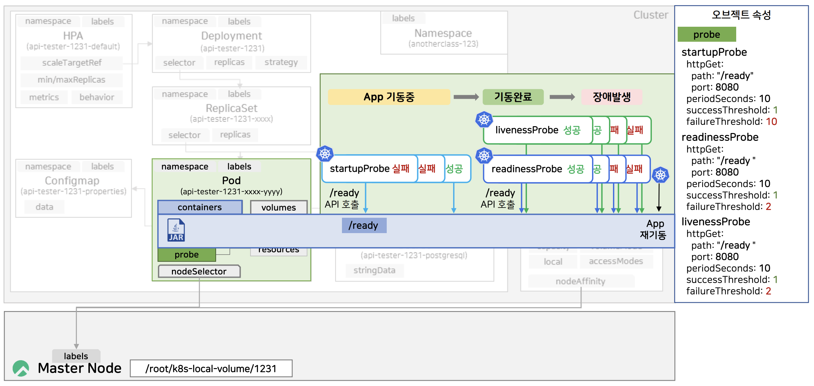
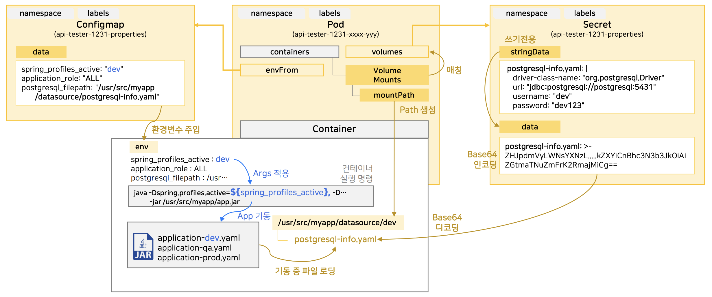

# [Kubernetes] Probe, Configmap, Secret

<!--more-->
<!-- Table of contents -->
* this unordered seed list will be replaced by the toc
{:toc}

<!-- text -->


# Probe 기본 개념

**startupProbe**
- 애플리케이션의 기동 상태를 확인해 애플리케이션이 정상적으로 초기화되기 전 외부 트래픽을 차단하고자 할 때 사용
- 스프링 부트 애플리케이션의 ApplicationContext refresh 과정이 다 끝나지 않아 API 호출을 아예 수행하지 못할 때 사용

**readinessProbe**
- 애플리케이션이 기동되었지만, 외부 트래픽을 차단하고자 할 때 사용
- 스프링 부트 애플리케이션의 초기화는 모두 끝났으나, 정상적인 서비스를 제공하기 위해 필요한 전처리 작업을 수행할 때 사용

**livenessProbe**
- 애플리케이션의 기동 상태를 확인해 애플리케이션이 비정상적인 상태일 때 파드를 재기동하기 위해 사용



## Probe 옵션

- startupProbe
    - periodSeconds : 10
        - 10초마다 /ready 엔드 포인트로 요청해 기동 상태 확인
    - successThreshold : 1
        - 성공 수치를 1로 설정
    - failureThreshold : 10
        - 실패 수치를 10으로 설정
- readinessProbe
    - periodSeconds : 10
        - 10초마다 /ready 엔드 포인트로 요청해 트래픽을 전달할 수 있는 상태인지 확인
        - 성공 시 서비스 활성화, 실패 시 연결 종료
    - successThreshold : 1
        - 성공 수치를 1로 설정
    - failureThreshold : 2
        - 실패 수치를 2로 설정
- livenessProbe
    - periodSeconds : 10
        - 10초마다 /ready 엔드 포인트로 요청해 애플리케이션이 정상 동작하는지 모니터링
        - 실패 시 애플리케이션 재시작


# Configmap & Secret



## Configmap
Kubernetes에서 ConfigMap을 사용하는 3가지 방법

1. 환경 변수로 사용하기
2. 볼륨으로 마운트하기 
3. 명령줄 인수로 사용하기

### 환경 변수로 사용하기
ConfigMap의 데이터를 환경 변수로 설정하여 컨테이너에서 사용할 수 있다.

```yaml
# configmap.yaml
apiVersion: v1
kind: ConfigMap
metadata:
  name: spring-config
data:
  spring_profiles_active: "dev"
```

```yaml
# deployment.yaml
apiVersion: apps/v1
kind: Deployment
metadata:
  name: spring-boot-app
spec:
  replicas: 1
  selector:
    matchLabels:
      app: spring-boot-app
  template:
    metadata:
      labels:
        app: spring-boot-app
    spec:
      containers:
      - name: spring-boot-container
        image: your-docker-image:latest
        env:
        - name: SPRING_PROFILES_ACTIVE
          valueFrom:
            configMapKeyRef:
              name: spring-config
              key: spring_profiles_active
```

### 볼륨으로 마운트하기
ConfigMap의 데이터를 파일로 마운트하여 컨테이너에서 사용할 수 있다.

```yaml
# configmap.yaml
apiVersion: v1
kind: ConfigMap
metadata:
  name: spring-config
data:
  application.properties: |
    spring.profiles.active=dev
```

```yaml
# deployment.yaml
apiVersion: apps/v1
kind: Deployment
metadata:
  name: spring-boot-app
spec:
  replicas: 1
  selector:
    matchLabels:
      app: spring-boot-app
  template:
    metadata:
      labels:
        app: spring-boot-app
    spec:
      containers:
      - name: spring-boot-container
        image: your-docker-image:latest
        volumeMounts:
        - name: config-volume
          mountPath: /config
      volumes:
      - name: config-volume
        configMap:
          name: spring-config
```

이렇게 하면 /config/application.properties 파일이 컨테이너 내에 생성된다.

### 명령줄 인수로 사용하기

ConfigMap의 데이터를 명령줄 인수로 전달하여 컨테이너에서 사용할 수 있다.

```yaml
# configmap.yaml
apiVersion: v1
kind: ConfigMap
metadata:
  name: spring-config
data:
  spring_profiles_active: "dev"
```

```yaml
# deployment.yaml
apiVersion: apps/v1
kind: Deployment
metadata:
  name: spring-boot-app
spec:
  replicas: 1
  selector:
    matchLabels:
      app: spring-boot-app
  template:
    metadata:
      labels:
        app: spring-boot-app
    spec:
      containers:
      - name: spring-boot-container
        image: your-docker-image:latest
        args:
        - "--spring.profiles.active=$(SPRING_PROFILES_ACTIVE)"
        env:
        - name: SPRING_PROFILES_ACTIVE
          valueFrom:
            configMapKeyRef:
              name: spring-config
              key: spring_profiles_active
```

## Secret
Secret은 민감한 정보를 저장하고 관리하는 데 사용된다. 주로 사용되는 방법은 아래와 같다.

1. 환경 변수로 사용하기
2. 볼륨으로 마운트하기

### 환경 변수로 사용하기

```yaml
# secret.yaml
apiVersion: v1
kind: Secret
metadata:
  name: db-secret
type: Opaque
data:
  username: dXNlcm5hbWU=  # base64 인코딩된 값
  password: cGFzc3dvcmQ=  # base64 인코딩된 값
```

여기서 username과 password는 base64로 인코딩된 값이다. 예를 들어, username의 실제 값이 username이라면, base64로 인코딩된 값은 dXNlcm5hbWU=이다.

```yaml
# deployment.yaml
apiVersion: apps/v1
kind: Deployment
metadata:
  name: my-app
spec:
  replicas: 1
  selector:
    matchLabels:
      app: my-app
  template:
    metadata:
      labels:
        app: my-app
    spec:
      containers:
      - name: my-container
        image: your-docker-image:latest
        env:
        - name: DB_USERNAME
          valueFrom:
            secretKeyRef:
              name: db-secret
              key: username
        - name: DB_PASSWORD
          valueFrom:
            secretKeyRef:
              name: db-secret
              key: password
```


### 볼륨으로 마운트하기
Secret의 데이터를 파일로 마운트하여 컨테이너에서 사용

```yaml
# secret.yaml
apiVersion: v1
kind: Secret
metadata:
  name: db-secret
type: Opaque
data:
  username: dXNlcm5hbWU=  # base64 인코딩된 값
  password: cGFzc3dvcmQ=  # base64 인코딩된 값
```

```yaml
# deployment.yaml
apiVersion: apps/v1
kind: Deployment
metadata:
  name: my-app
spec:
  replicas: 1
  selector:
    matchLabels:
      app: my-app
  template:
    metadata:
      labels:
        app: my-app
    spec:
      containers:
      - name: my-container
        image: your-docker-image:latest
        volumeMounts:
        - name: secret-volume
          mountPath: /etc/secrets
          readOnly: true
      volumes:
      - name: secret-volume
        secret:
          secretName: db-secret
```

이렇게 하면 /etc/secrets/username과 /etc/secrets/password 파일이 컨테이너 내에 생성된다. 파일의 내용은 base64로 디코딩된 실제 값이 된다.

