# Setting

<!--more-->
<!-- Table of contents -->
* this unordered seed list will be replaced by the toc
  {:toc}

1. 환경 설정

우분투 22.04 버전 설치(2년마다 4월에 lts를 오픈하기 때문에 그렇다. 반드시 22.04를 설치 하자)
https://ubuntu.com/tutorials/install-ubuntu-desktop
https://ubuntu.com/download/desktop

2. default Terminal 을 가장 많이 사용한다.

우분투에 terminator를 설치해 보자

sudo apt update 
sudo apt install terminator

실행(터미널에서)
terminator

장점 : 화면 분할이 된다. (마우스 우클릭)

3. 크롬 설치

sudo apt update
wget --version
sudo apt install wget
wget http://dl.google.com/linux/direct/google-chrome-stable_current_amd64.deb
sudo dpkg -i google...(받은 파일 압축 해제)
sudo apt install chromium-browser

4. Python 가상환경 만들기

파이썬은 버전에 예민 하다. 파이썬은 많은 모듈들이 있다. 버전이 다를땐 가상환경을 구성한다.

// 확인 없으면 어떻게 깔라고 주석으로 나옴
pip3 -v
pip3 install --upgrade pip

5. Jupyter Notebook

장점 : 실행 코드를 라인별로 실행 할 수 있다.

sudo apt install python3-pip
pip3 install --upgrade pip

jupyter --version
pip install jupyter(or pip3)

mkdir python
cd python/
jupyter notebook
단축키 : shift + enter (한줄 실행)
esc를 누르면 커서가 사라지면서 입력 할 수 있게 된다

6. VSCode

다운로드 링크 : https://code.visualstudio.com/Download
sudo apt install ./Download.../....deb

// 실행
code

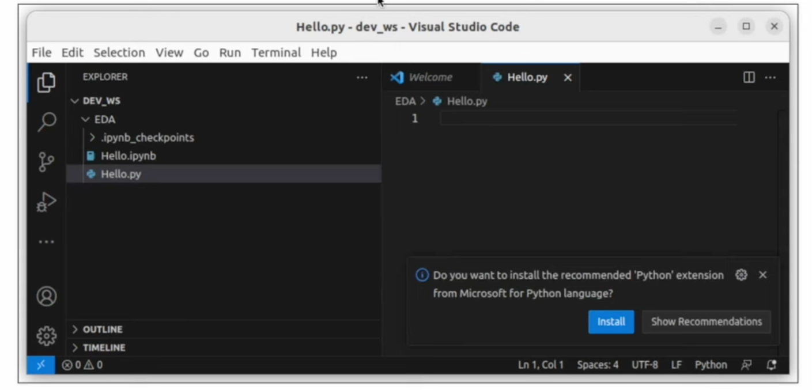
여기 있는 인스톨은 눌러준다.

VSCode에서 주피터 사용하기

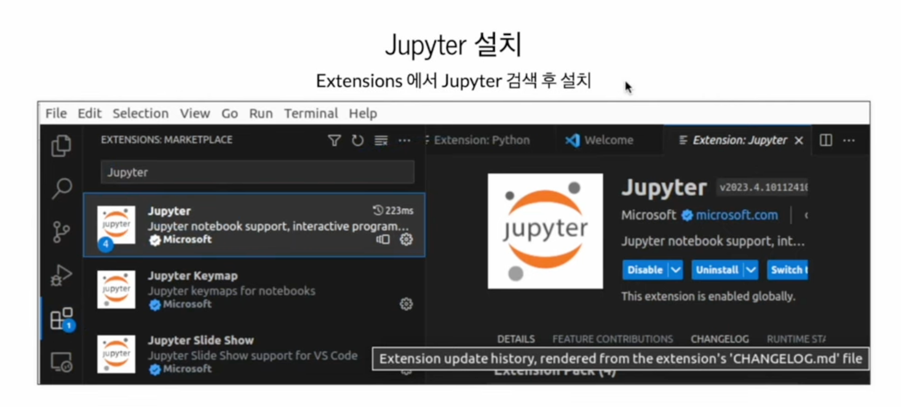

Jupyter Keymap도 다운 받는다.

ipynb 확장자 파일 실행시 실행 된다.

7. sublime text

8. Ros2 Humble 설치

로스는 우분투 버전에 맞춰서 설치되고 있다. Humble은 22.04 버전의 이름
https://docs.ros.org/en/humble/installation.html

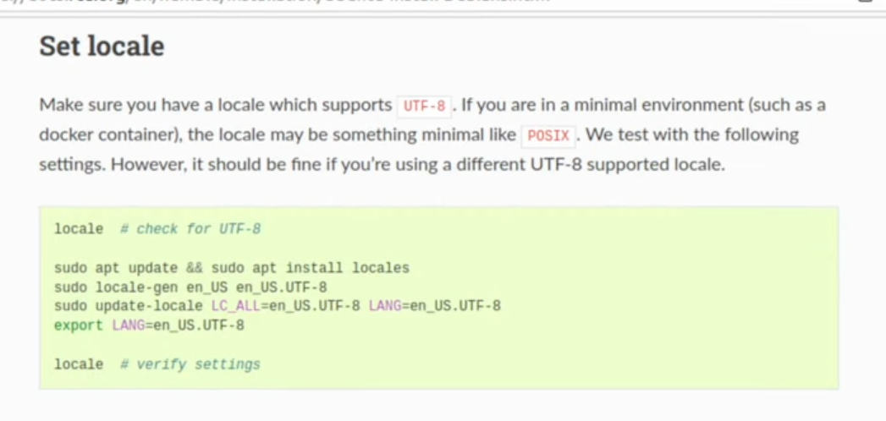
암호 입력 해줘야 한다.

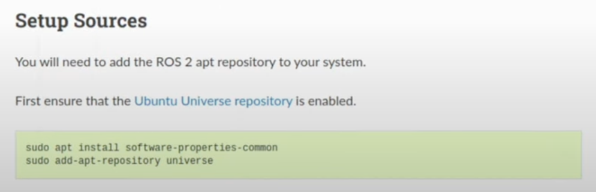
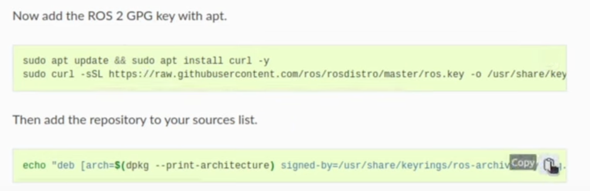
둘 다 한다.

// 잘 설치 됬는지 확인하고 가끔 에러 날땐 해당 리스트 삭제 하면됨
ls /etc/apt/sources.list.d

sudo apt update

sudo apt install ros-humble-desktop

// 설치 완료후 확인 하는 방법
// 창 두개 띄운다
// 설치 보관 장소
ls /opt
ls /opt/ros/humble/

// 여기까진 양쪽 동일
source /opt/ros/humble/setup.bash

// 토커 실행(1번)
ros2 run demo_nodes_cpp talker

// 리스너 실행(2번)
ros2 run demo_nodes_py listener

// 3번째 창을 열어서 그래프를 실행한다.
source /opt/ros/humble/setup.bash
rqt_graph

// 왼쪽위 리프레
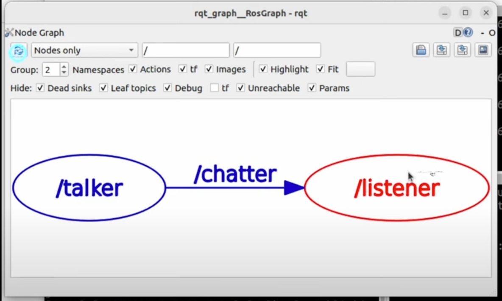

// bashrc(터미널 실행시 가장 먼저 실횅하는 설정들을 보관 하고 있는 파일들, 아래의 루트에 있고, 명령어로 실행할 수 있다.)
subl ~/.bashrc

// bashrc 가장 아래 추가해 준다. 로스를 실행하기 위한 방법
echo "ROS2 humble is activated!"
source /opt/ros/humble/setup.bash

// bashrc 에서 alias 설정(내가 원하는 명령을 만들겠다)
// ex : alias command_name="values" (주의 : name과 value 사이의 등호는 꼭 띄어쓰기 없이 붙여 써야 한다.)

// 목록 조회 alias
alias

// humble도 만들어 보자(수정후엔 꼭 저장하고 source ~/.bashrc 를 입력해 줘야 한다.) ros1과 ros2의 차이점은 도메인이다 
alias sb="source ~/.bashrc; echo \"bashrc is reloaded\""
alias ros_domain="export ROS_DOMAIN_ID=13; echo \"ROS_DOMAIN_ID=13\""
alias humble="source /opt/ros/humble/setup.bash; ros_domain; echo \"ROS2 humble is activated!\""

// Turtlesim(보통 설치가 되어 있다. 안되어 있을경우 아래 명령어 실행)
sudo apt install ros-humble-turtlesim

// node의 실행(실행가능한 최소의 단위)
ros2 run <PKG Name> <Node Name>

// turtlesim_node 실행
ros2 run turtlesim turtlesim_node
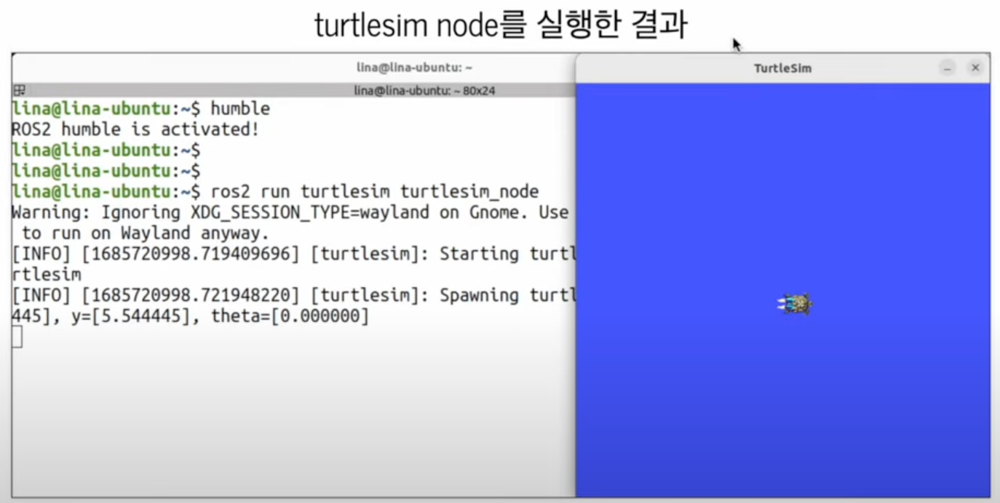

// 목록 보기(로스 도메인 아이디를 제대로 입력 했다면 /turtlesim 이라고 보인다.)
ros2 node list
// 정보 보기
ros2 node info /turtlesim

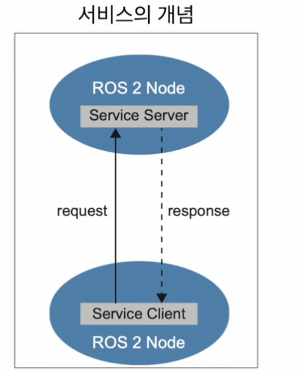

// ros2 service 기초 

/// 타입 확인
ros2 service type /turtle1/teleport_absolute

/// 데이터 타입을 알려준다(---를 기준으로 위는 request 아래는 response)
ros2 interface show turtlesim/srv/TeleportAbsolute

// 단위
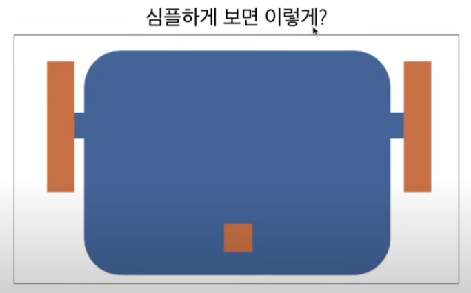
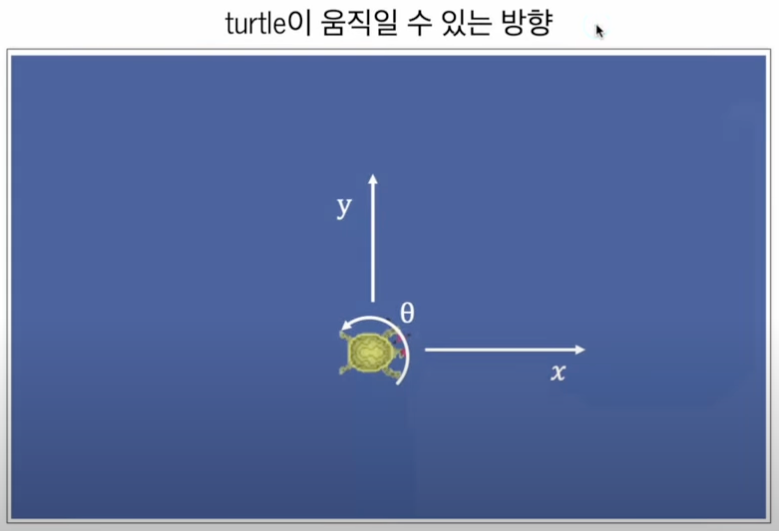
// 각도(로스는 라디안 단위를 좋아한다 1바퀴가 2파이)
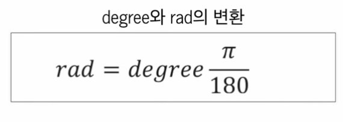

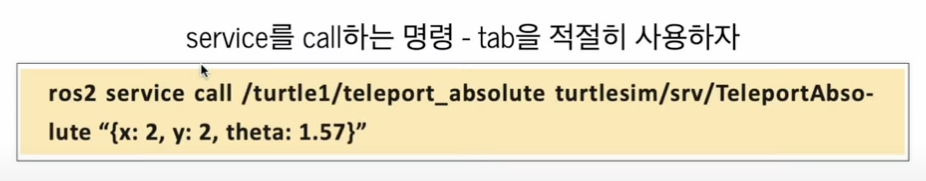
// 사용 방법
ros2 service call /turtle1/teleport_absolute turtlesim/srv/TeleportAbsolute "{x: 2, y: 2, theta: 1.57}" 
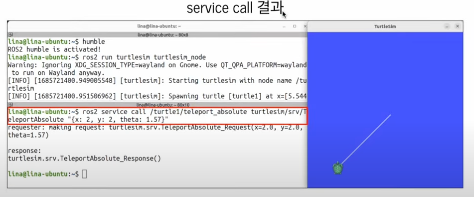

// 타입 확인
ros2 service type /reset
ros2 interface show std_srvs/srv/Empty
ros2 service call /reset std_srvs/srv/Empty {}

// service list에서 앞에 경로가 다른 애들이 있다.
// 앞에 있는 구분자는 네임스페이스다 ex /turtle1/ or /turtle2/

// 토픽

/// 토픽 타입은 토픽이 주고받을 메세지 타입
ros2 topic type /turtle1/pose
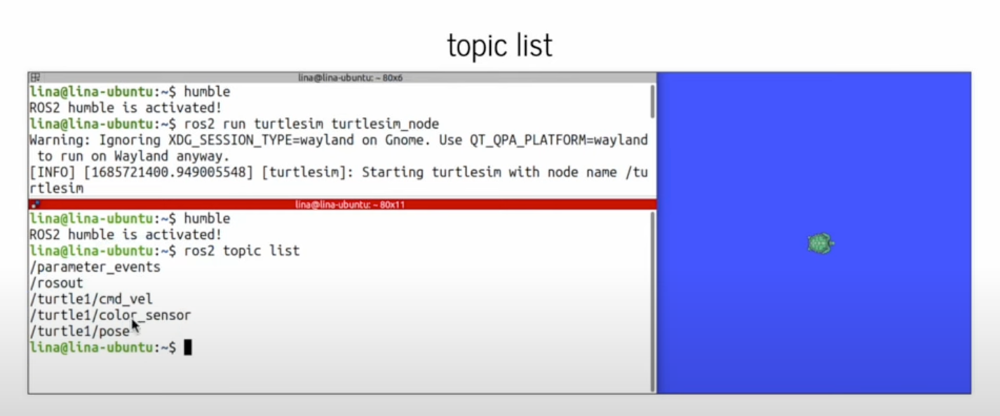
/// 리스트에 타입도 나오는거
ros2 topic list -t
/// 토픽 info
ros2 topic info /turtle1/pose
/// 전체 리스트 조회
ros2 topic list -v
///
ros2 interface show turtlesim/msg/Pose
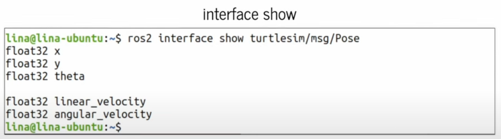

// ex : 터틀의 위치를 반환함
ros2 topic echo /turtle1/pose

// 디버그 툴
rqt_graph
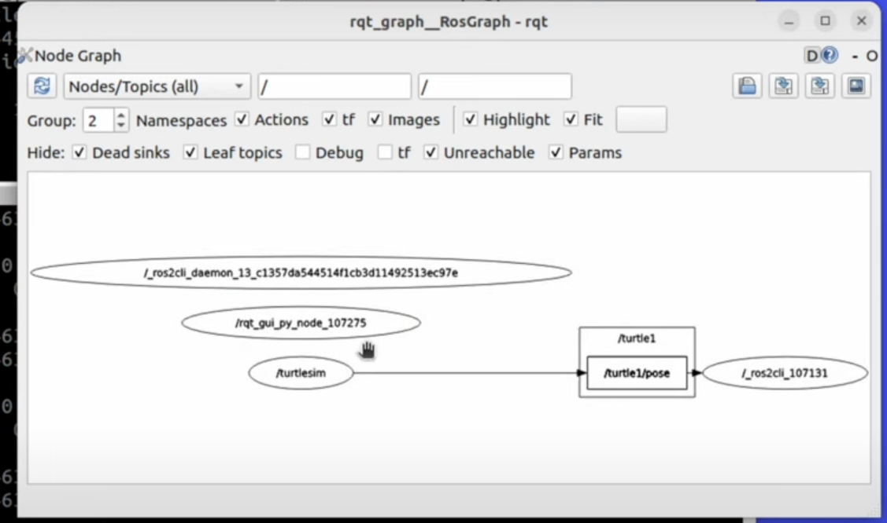