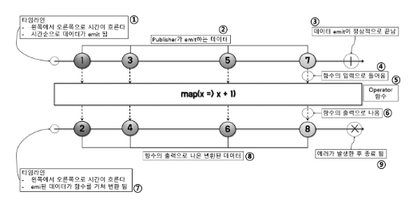

# [Spring-Batch] Spring Batch

<!--more-->
<!-- Table of contents -->
* this unordered seed list will be replaced by the toc
{:toc}

<!-- text -->

# 배치 서비스 기본 3단계
- `Read` 많은 데이터를 DB, file, message 로 부터 읽는다.
- `Processing` 읽은 데이터를 로직에 의해 처리한다.
- `Write` 로직으로 처리된 데이터를 수정된 형태로 출력한다.

**tip. 배치는 알림과 모니터링 필수**

# 배치 처리 대표적인 도구들
- Cron, Crontab
- Quartz
- Jenkins
- SpringBatch

# SpringBatch

## 스프링 배치의 지원 기능
- `트랜잭션` 관리
- `청크 단위`의 처리
- 선언적 입출력 지원
- `병렬처리`
- 시작, 중지, 재시작 지원
- 재시도 또는 건너뛰기 지원
- 웹기반 관리 인터페이스 제공 (Spring Cloud Data Flow)

## 스프링 배치 아키텍처
- 3개의 티어로 구성된 아키텍처(어플리케이션, 코어, 인프라스트럭처)
  - `어플리케이션` - 코어와 상호 작용
  - `코어` - 잡, 스텝, 잡 런처, 잡 파라미터 등의 배치 도메인 요소들
  - `인프라스트럭처` - 배치 처리를 위해 필요한 공통 인프라 제공


## 스프링 배치 도메인 언어
- 스프링 배치 어플리케이션을 작성하기 위해 필요한 요소
- Job
  - JobInstance
  - JobExecution
  - JobParameter
  - JobListener
- Step
  - Tasklet 기반
  - Chunk 기반



### Job
- 스프링 배치의 실행 단위
- 여러 개의 `Step`을 포함하는 컨테이너
- 독립적이고 외부와 상호작용 없이 처음부터 끝까지 실행됨
- 스프링 빈으로 유일하게 등록됨

#### `스프링 빈으로 유일하게 등록됨` 예제

```java
@Bean
public Job myJob(JobBuilderFactory jobBuilderFactory, Step step) {
    return jobBuilderFactory.get("myJob") // ← 이름
            .start(step)
            .build();
}
```

> 여기서 `myJob`이라는 이름을 가진 Job이 스프링 컨테이너에 등록된다.  
이 이름으로 또 다른 Job을 등록하려고 하면 충돌 발생!  
  
왜 이렇게 설계됐을까?  
> 스프링 배치는 Job을 실행할 때 이름으로 식별한다.  
그래서 이름이 고유해야, 어떤 Job을 실행할지 정확하게 알 수 있다.

### JobInstance란?
> Job을 실행할 때 Job 이름 + Job 파라미터 조합으로 하나의 JobInstance가 생성  
즉, "무엇을 어떤 조건으로 실행했는가?"를 기준으로 구분된다.  
같은 Job 이름에 같은 파라미터로는 한 번만 실행 가능하다. (이미 실행했으면 재실행 불가)  
재실행하고 싶다면 파라미터를 바꾸거나 Job 이름을 바꿔야 한다.

#### 예시

```java
JobParameters params1 = new JobParametersBuilder()
    .addString("date", "2025-04-08")
    .toJobParameters();

jobLauncher.run(myJob, params1);
```

이렇게 실행하면, `myJob`이라는 이름과 `date=2025-04-08`이라는 파라미터를 가진 `JobInstance` 하나가 만들어진다.  

이걸 다시 실행하면?

```java
jobLauncher.run(myJob, params1);
```

이미 같은 이름과 파라미터로 실행한 적 있기 때문에,  
`JobInstance already exists and is complete` 같은 예외가 발생할 수 있다.

다시 실행 하고 싶다면?

```java
JobParameters params2 = new JobParametersBuilder()
    .addString("date", "2025-04-09")  // 파라미터 값 변경
    .toJobParameters();

jobLauncher.run(myJob, params2);
```

같은 조합은 한 번만 실행 가능, 재실행은 파라미터를 바꿔야 한다.


### JobExecution
- Job을 실행한 것을 의미
- 실패든 성공이든 시도한 것을 나타낸다.
- JobInstance가 실제로 실행된 기록
- 하나의 JobInstance는 여러 번 실행될 수 있다. (예: 실패해서 재시도하는 경우)
- 각각의 실행 시도마다 JobExecution이 생성된다.


```java
JobParameters params = new JobParametersBuilder()
    .addString("date", "2025-04-08")
    .toJobParameters();

JobExecution jobExecution = jobLauncher.run(myJob, params);
System.out.println("Execution Status: " + jobExecution.getStatus());

```

> 여기서 jobExecution은 실제 실행 시도에 대한 정보이다.  
실패하면 다시 시도 가능하고, 그때마다 새로운 JobExecution이 생성된다.  
하지만 JobInstance는 동일한 것 (Job 이름 + 파라미터가 같으므로).


JobExecution은 아래와 같은 상태(status)를 가질 수 있다.

- STARTING
- STARTED
- FAILED
- COMPLETED
- STOPPED
- ABANDONED

### JobParameter
- 잡에 전달되는 파라미터

### JobListener
- Job의 시작 전/후에 실행되는 로직을 정의할 수 있게 해주는 콜백 인터페이스
- 흔히 로그 기록, 리소스 정리, 실행 시간 측정, 알림 발송 같은 걸 할 때 쓴다.

#### 대표 인터페이스
> JobExecutionListener 인터페이스가 가장 많이 쓰인다.

```java
public interface JobExecutionListener {
    void beforeJob(JobExecution jobExecution); // Job이 시작되기 바로 전에 호출됨
    void afterJob(JobExecution jobExecution); // Job이 끝난 후에 호출됨 (성공이든 실패든)
}
```