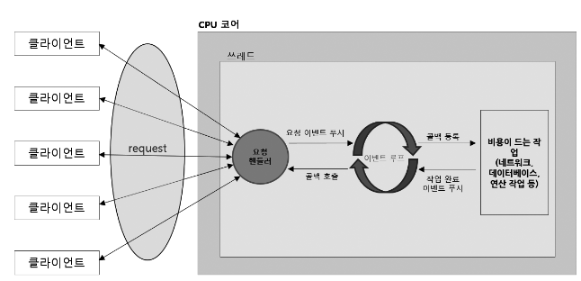

# [Spring-Reactive] 리액티브 시스템과 리액티브 프로그래밍

<!--more-->
<!-- Table of contents -->
* this unordered seed list will be replaced by the toc
{:toc}

<!-- text -->

## 리액티브 시스템이란?
> 변화에 민감하게 반응하고(Responsive), 실패에 강하며(Resilient), 부하에 따라 유연하게 확장되고(Elastic), 메시지 기반(Message Driven)으로 구성된 시스템을 말한다.  
(즉, 안정적이고 유연하며 빠른 응답을 보장하는 현대적인 시스템 설계 방식)

## 리액티브 선언문
> 리액티브 선언문은 이랙티브라는 용어의 의미를 올바르게 정의하기 위해 노력하는 사람들이 만든 리액티브 시스템 구축을 위한 일종의 설계 원칙



| 항목         |간단 정의|예시 또는 관련 특성|
|------------|---|---|
| VALUE (가치) | 우리가 리액티브 시스템에서 얻고자 하는 최종 목표 | Responsive (응답성) – 빠르고 안정적인 응답|
 | FORM (형식)  | 그 가치를 달성하기 위한 시스템의 구조적 성질 | Elastic (탄력성), Resilient (회복성)|
 | MEANS (수단) | 형식을 구현하기 위한 구체적인 실행 수단 | Message Driven (메시지 기반) 아키텍처|

## 리액티브 프로그래밍의 특징
- `선언형 프로그래밍 방식` : 동작을 어떻게 수행할지를 명령하지 않고, 무엇을 할지만 선언함
  - → 코드가 간결하고 의도를 명확하게 표현

```java
// 명령형(for문을 돌아라, A로 시작되는걸 찾아서 넣어라)
List<String> result = new ArrayList<>();
for(String s : list) {
    if(s.startsWith("A")) result.add(s);
}

// 선언형(A로 시작되는걸 필터링 한다)
List<String> result = list.stream()
        .filter(s -> s.startsWith("A"))
        .toList();
```

- `데이터 스트림(data streams)` : 데이터가 지속적으로 흐름
  - → 시간의 흐름에 따라 발생하는 데이터를 처리

```java
// 예시 : 센서에서 실시간으로 온도가 들어오는 경우, Flux<Integer> 로 1초마다 온도 값 수신
Flux.interval(Duration.ofSeconds(1))
    .map(tick -> getTemperatureFromSensor())
    .subscribe(temp -> System.out.println("현재 온도: " + temp));
```

- `변화의 전파(propagation of change)` : 데이터에 변화가 생기면 자동으로 관련된 연산에 전파
  - → 이벤트 기반 반응 처리 가능

```java
// 예시 : 사용자의 이름이 바뀌면, UI 화면에 자동으로 반영
BehaviorSubject<String> username = BehaviorSubject.createDefault("Alice");

username.subscribe(name -> System.out.println("이름 변경됨: " + name));

username.onNext("Bob"); // onNext를 통해 'Bob' 입력시 '이름 변경됨: Bob' 내용이 자동으로 출력된다.
```

## 리액티브 프로그래밍 코드 구성

| 구성 요소       | 역할 요약|
|-------------|---|
| Publisher   | 데이터를 발행함 (생산자 역할)|
 | Subscriber  | 데이터를 구독하고 소비함 (소비자 역할)|
 | Data Source | Publisher에 입력되는 실제 원천 데이터|
 | Operator    | Publisher → Subscriber 사이에서 데이터 변환/가공|

```java
Flux<Integer> source = Flux.range(1, 5);              // Data Source + Publisher
Flux<Integer> mapped = source.map(i -> i * 10);       // Operator(데이터를 가공: 1 → 10, 2 → 20 ...)
mapped.subscribe(System.out::println);                // Subscriber(가공된 데이터를 소비)
```

## 리액티브 스트림즈란?
> 리액티브 스트림즈는 데이터 스트림을 비동기·논블로킹 방식으로 처리하기 위한 표준이며, RxJava, Reactor(Spring Framework와 궁합이 좋다) 등이 대표 구현체다.

### 리액티브 스트림즈 구성요소 요약
- **Publisher**: 데이터를 생성하고 전달(발행)하는 역할.
- **Subscriber**: Publisher로부터 전달받은 데이터를 처리하는 역할.
- **Subscription**: Subscriber가 요청할 데이터 개수를 지정하고 구독을 취소하는 역할.
- **Processor**: Publisher이면서 Subscriber 역할도 함께 하는 중간 처리자.

**동작 흐름 요약**  
1. Subscriber가 Publisher를 구독(`subscribe`)한다.
2. Publisher가 구독 준비 완료를 알린다(`onSubscribe`).
3. Subscriber가 필요한 데이터 개수를 요청한다(`request`).
4. Publisher가 요청한 만큼 데이터를 전달한다(`onNext`).
5. 데이터가 모두 전달되면 완료를 알린다(`onComplete`), 에러 발생 시(`onError`) 알린다.

#### 리액티브 스트림즈 구성요소 코드 예시

**Publisher**  
- Subscriber를 등록받고 데이터를 발행하는 인터페이스.
```java
public interface Publisher<T> {
    public void subscribe(Subscriber<? super T> s);
}
```

**Subscriber**  
- Publisher가 발행한 데이터를 받아 처리하는 인터페이스.
```java
public interface Subscriber<T> {
    public void onSubscribe(Subscription s); // 구독 시작, Subscription 수신.
    public void onNext(T t); // 데이터 수신.
    public void onError(Throwable t); // 에러 처리.
    public void onComplete(); // 데이터 송신 완료 알림.
}

```

**Subscription**
- 데이터 요청량을 제어하거나 구독을 취소하는 인터페이스.

```java
public interface Subscription {
    public void request(long n);
    public void cancel();
}
```

**통합 예시**  

|컴포넌트 | 역할|
|---|---|
|MyPublisher | 1~5까지 데이터를 발행|
|MyProcessor | 데이터를 10배로 가공|
|MySubscriber | 가공된 데이터를 받아 출력|
|Subscription | 몇 개의 데이터를 받을지 요청하고 관리|


```java
import org.reactivestreams.*;

// 메인 실행 클래스
public class SimpleExample {
    public static void main(String[] args) {
        Publisher<Integer> publisher = new MyPublisher(); // 데이터 만드는 Publisher
        Processor<Integer, Integer> processor = new MyProcessor(); // 중간 가공하는 Processor
        Subscriber<Integer> subscriber = new MySubscriber(); // 최종 소비하는 Subscriber

        publisher.subscribe(processor); // Processor가 Publisher를 구독
        processor.subscribe(subscriber); // Subscriber가 Processor를 구독
    }
}

// 데이터를 발행하는 Publisher
class MyPublisher implements Publisher<Integer> {
    @Override
    public void subscribe(Subscriber<? super Integer> subscriber) {
        // ⭐ Subscription 객체 생성 ⭐
        Subscription subscription = new Subscription() {
            @Override
            public void request(long n) { // 데이터 n개 요청 처리
                for (int i = 1; i <= n; i++) {
                    subscriber.onNext(i); // 데이터 하나씩 발행
                }
                subscriber.onComplete(); // 모든 데이터 발행 후 완료 알림
            }

            @Override
            public void cancel() { // 구독 취소 시 동작
                System.out.println("구독 취소");
            }
        };
        subscriber.onSubscribe(subscription); // ⭐ Subscriber에게 Subscription 전달 (구독 시작 알림) ⭐
    }
}

// 데이터를 가공하는 Processor (Publisher + Subscriber 둘 다 역할)
class MyProcessor implements Processor<Integer, Integer> {
    private Subscriber<? super Integer> downstream; // 다음 Subscriber를 저장

    @Override
    public void subscribe(Subscriber<? super Integer> subscriber) {
        this.downstream = subscriber; // downstream 저장
    }

    @Override
    public void onSubscribe(Subscription subscription) {
        // ⭐ Publisher에게 데이터 5개를 요청 ⭐
        subscription.request(5);
    }

    @Override
    public void onNext(Integer item) {
        downstream.onNext(item * 10); // 받은 데이터 가공 후 downstream에 전달
    }

    @Override
    public void onError(Throwable t) {
        downstream.onError(t); // 에러 전달
    }

    @Override
    public void onComplete() {
        downstream.onComplete(); // 완료 신호 전달
    }
}

// 데이터를 소비하는 Subscriber
class MySubscriber implements Subscriber<Integer> {
    @Override
    public void onSubscribe(Subscription subscription) {
        // ⭐ Processor에게 무한 데이터 요청 (Long.MAX_VALUE) ⭐
        subscription.request(Long.MAX_VALUE);
    }

    @Override
    public void onNext(Integer item) {
        System.out.println("받은 데이터: " + item); // 받은 데이터 출력
    }

    @Override
    public void onError(Throwable t) {
        System.out.println("에러: " + t.getMessage()); // 에러 출력
    }

    @Override
    public void onComplete() {
        System.out.println("완료!"); // 완료 메시지 출력
    }
}

```

**Processor**
- `Subscriber` + `Publisher`를 동시에 구현하는 중간 처리자.

### 리액티브 스트림즈 관련 용어 정의
> 리액티브 스트림즈는 Signal로 소통하고, Demand로 요청하고, Emit으로 발행하며, 데이터는 Upstream → Downstream 방향으로 Sequence를 따라 Operator로 처리(가공)되고, Source(데이터)에서 시작된다.

|용어 | 의미|
|---|---|
|Signal | Publisher와 Subscriber 간에 주고받는 신호 (ex. onNext, onError, onComplete 호출)|
|Demand | Subscriber가 Publisher에게 데이터를 "요청"하는 것 (request 메서드 호출)|
|Emit | Publisher가 데이터를 "발행"해서 Subscriber에게 보내는 것|
|Upstream/Downstream | 데이터 흐름 방향: Upstream(위쪽, 데이터 제공자) → Downstream(아래쪽, 데이터 소비자)|
|Sequence | 데이터의 연속적인 흐름(시퀀스), 연산자 체인으로 이어지는 데이터 흐름|
|Operator | 데이터를 변환하거나 가공하는 메서드들 (ex. map, filter)|
|Source | 데이터의 시작점(원본), ex. Data Source, Source Flux 등|


### 리액티브 스트림즈 구현 규칙
> 요청한 만큼만 안전하게 데이터를 보내고, 실패하거나 끝나면 깨끗하게 정리한다.

#### Publisher 구현 규칙
- 요청한 데이터 수 이하로만 `onNext` 호출해야 한다.
- 데이터 발행 중 실패하면 `onError`, 성공하면 `onComplete` 호출해야 한다.
- 완료(`onComplete`) 또는 에러(`onError`) 후에는 더 이상 Signal을 보내면 안 된다.
- 구독이 취소되면 데이터 발행을 멈춰야 한다.

#### Subscriber 구현 규칙
- 데이터를 받고 싶으면 반드시 `request(n)`를 호출해야 한다.
- `onComplete`나 `onError` 받은 후에는 다른 메서드를 호출하면 안 된다.
- 구독이 끝나면 Subscription을 명확히 취소하거나 정리해야 한다.
- 하나의 Subscriber는 하나의 Subscription만 유지해야 한다.

#### Subscription 구현 규칙
- `request(n)` 호출은 동기적으로 처리해도 된다.
- 구독이 취소되면 `request(n)`이 더 이상 동작하면 안 된다.
- 잘못된 요청(`n <= 0`)은 에러(`onError`)를 보내야 한다.
- 무한 요청(`Long.MAX_VALUE`)도 지원해야 한다 (Unbounded Stream).

#### Processor
- Publisher + Subscriber 규칙을 동시에 지켜야 한다.


## RxJava, Reactor, WebFlux의 관계
> RxJava와 Reactor는 모두 Reactive Streams 표준을 구현한 라이브러리로, 목적은 비슷하지만 주로 사용되는 생태계와 환경이 다르다. Spring WebFlux는 Reactor를 기반으로 동작하며, RxJava와는 직접적인 관계가 없다. 그러나 RxJava를 사용할 수도 있다.

### Reactor
> Reactor는 스프링 팀이 만든 Reactive Streams 구현체로, WebFlux의 핵심 엔진 역할을 한다.
> Reactive Streams 표준을 준수하며, 비동기 데이터 처리와 논블로킹 스트림을 효율적으로 관리한다.
> 
> Reactor의 주요 클래스:
> - Mono: 0~1개의 데이터를 비동기로 처리.
> - Flux: 0~N개의 데이터를 비동기로 처리.
> 
> Reactor는 WebFlux뿐 아니라, 다른 스프링 모듈(예: Spring Data Reactive, Spring Security Reactive)에서도 사용된다.

### Spring WebFlux
> Spring WebFlux는 스프링 프레임워크에서 제공하는 논블로킹(Non-Blocking) 비동기 웹 애플리케이션 개발을 위한 프레임워크이다.
> - Spring MVC와 유사한 역할을 하지만, Reactive Programming을 기반으로 설계되었다.
> - Servlet API 대신 Netty, Undertow 같은 논블로킹 서버를 사용할 수 있다.
> - 내부적으로 Reactor를 기반으로 동작하며, 데이터를 스트림 형태로 처리한다.

### RxJava
> RxJava는 Netflix가 만든 Reactive Programming 라이브러리로, Reactor와 마찬가지로 Reactive Streams 표준을 지원한다.
> - Reactor와 목적은 동일하지만, 다음과 같은 차이점이 있다:
>   - 범용성: RxJava는 스프링 생태계와 독립적으로 사용되며, 다양한 Java 애플리케이션에서 사용 가능하다.
>   - 스프링과의 통합: Reactor는 스프링 프레임워크와 긴밀하게 통합되어 있으며, RxJava보다 스프링 프로젝트에서 더 많이 사용된다.


## Blocking I/O
> Blocking I/O는 I/O 작업 완료까지 스레드를 대기시키기 때문에 CPU 낭비, 컨텍스트 스위칭 비용, 메모리 오버헤드, 스레드 풀 지연 등 다양한 성능 문제가 발생한다.

### 1. Blocking I/O란?
- 외부 장치(디스크, 네트워크 등)로부터 데이터를 읽거나 쓸 때 **I/O 작업이 끝날 때까지 스레드가 대기**하는 방식이다.
- 예시: 파일 읽기, DB 조회, 네트워크 통신.

### 2. Blocking I/O 문제점
- **CPU 낭비**: 스레드가 대기하는 동안 CPU는 다른 일을 못 한다.
- **Context Switching 비용**: 많은 스레드가 대기하면 전환 비용이 커져 성능이 저하된다.
- **과도한 메모리 사용**: 스레드마다 Stack 메모리가 필요해서 메모리 소모가 커진다.
- **스레드 풀 한계**: 스레드 풀이 있어도 요청이 몰리면 풀에 스레드가 부족해져 추가 지연이 발생할 수 있다.

### 3. Context Switching이란?
- CPU가 실행 중인 프로세스를 멈추고 다른 프로세스를 실행하기 위해 **PCB(Process Control Block)** 저장/복원하는 과정.
- 전환(스위칭)마다 시간이 들고, 이게 많아지면 **CPU 전체 성능이 하락**한다.

### 4. 메모리/응답 문제
- 스레드 하나당 기본 스택 메모리 필요(예: 64비트 JVM 기본 1MB).
- 수천~수만 개 스레드가 생성되면 **메모리 오버헤드**가 발생할 수 있다.
- 스레드 풀이 있어도, 풀에 남은 스레드가 없으면 **추가 요청이 대기**하게 되어 응답 지연이 생긴다.

---

## Non-Blocking I/O 핵심 요약
> Non-Blocking I/O는 스레드가 작업 완료를 기다리지 않고 즉시 다음 요청을 처리해 CPU와 메모리를 효율적으로 사용하지만, CPU 작업량이 많거나 Blocking 요소가 섞이면 이점을 살리기 어렵다.

### 1. Non-Blocking I/O란?
- Blocking I/O와 달리, **작업 완료를 기다리지 않고** 스레드가 **바로 다음 작업**을 처리할 수 있다.
- 요청한 스레드는 **차단(blocking)되지 않고 즉시 반환**된다.

### 2. Non-Blocking I/O 특징
- **작업 스레드 종료 여부와 관계없이** 다음 요청을 처리할 수 있다.
- **CPU 대기 시간**과 **메모리 사용량**이 줄어든다.
- **적은 수의 스레드**로 **많은 요청**을 효율적으로 처리할 수 있다.
- Blocking I/O에 비해 **멀티스레딩 오버헤드**(context switching, 메모리 낭비)가 거의 없다.

### 3. Non-Blocking I/O 한계
- **CPU 사용량이 많은 작업**이 포함되면 오히려 성능이 떨어질 수 있다.
- 요청 처리 흐름에 **Blocking I/O가 끼어 있으면** Non-Blocking의 이점을 살리기 어렵다.

### 4. 완전한 Non-Blocking I/O (Fully Non-Blocking)
- 네트워크 통신뿐 아니라 **DB 조회** 등도 모두 Non-Blocking이어야 진정한 Non-Blocking 효과를 볼 수 있다.
- 하나라도 Blocking 작업이 끼면 **스레드 차단(병목)**이 발생할 수 있다.

---

## 📚 Spring Framework에서의 Blocking I/O vs Non-Blocking I/O
> Spring MVC는 요청마다 스레드가 대기해서 느려지고, Spring WebFlux는 스레드 차단 없이 동시에 많은 요청을 빠르게 처리한다.

### Spring MVC (Blocking I/O)

- **요청당 스레드가 대기**한다. (요청 처리 완료될 때까지 멈춤)
- 많은 요청 → **CPU 낭비**, **메모리 과다 사용**, **응답 지연**.
- `RestTemplate` 사용 → 요청하고 결과 받을 때까지 기다림.

### Spring WebFlux (Non-Blocking I/O)

- **요청 후 스레드는 바로 반환**된다. (다음 요청 바로 처리)
- 적은 스레드로 많은 요청을 **효율적으로 처리**.
- `WebClient` 사용 → 비동기로 요청하고, 응답도 비동기로 처리(`Mono`, `Flux`).

---

### 2-1. Blocking I/O 예시 (Spring MVC)

**[본사 서버 Controller]**

```java
@RestController
public class HeadOfficeController {
    @GetMapping("/v1/books/{id}")
    public ResponseEntity<Book> getBook(@PathVariable Long id) {
        Book book = restTemplate.getForEntity("http://localhost:7070/v1/books/" + id, Book.class).getBody();
        return ResponseEntity.ok(book);
    }
}
```

**[지점 서버 Controller]**

```java
@RestController
public class BranchOfficeController {
    @GetMapping("/v1/books/{id}")
    public ResponseEntity<Book> getBook(@PathVariable Long id) throws InterruptedException {
        Thread.sleep(5000); // 5초 대기
        return ResponseEntity.ok(bookMap.get(id));
    }
}
```

**[클라이언트]**

```java
for (int i = 1; i <= 5; i++) {
    Book book = restTemplate.getForEntity("http://localhost:8080/v1/books/" + i, Book.class).getBody();
    log.info("Book name: {}", book.getName());
}
```

- 요청 하나 완료될 때까지 다음 요청 **못 보냄** → 총 25초 걸림

---

### 2-2. Non-Blocking I/O 예시 (Spring WebFlux)

**[본사 서버 Controller]**

```java
@RestController
public class ReactiveHeadOfficeController {
    @GetMapping("/v1/books/{id}")
    public Mono<Book> getBook(@PathVariable Long id) {
        return WebClient.create()
            .get()
            .uri("http://localhost:5050/v1/books/" + id)
            .retrieve()
            .bodyToMono(Book.class);
    }
}
```

**[지점 서버 Controller]**

```java
@RestController
public class ReactiveBranchOfficeController {
    @GetMapping("/v1/books/{id}")
    public Mono<Book> getBook(@PathVariable Long id) throws InterruptedException {
        Thread.sleep(5000); // 5초 대기 (Blocking 남아있음)
        return Mono.just(bookMap.get(id));
    }
}
```

**[클라이언트]**

```java
for (int i = 1; i <= 5; i++) {
    WebClient.create()
        .get()
        .uri("http://localhost:6060/v1/books/" + i)
        .retrieve()
        .bodyToMono(Book.class)
        .subscribe(book -> log.info("Book name: {}", book.getName()));
}
```

- 요청을 **동시에 보냄** → 전체 5초 만에 끝남


## Non-Blocking I/O 방식이 적합한 시스템

### 1. Spring WebFlux를 무조건 써야 할까?
- 무조건 Spring MVC → WebFlux로 바꿀 필요는 없음.
- **적합한 상황**에만 WebFlux를 쓰는 게 현실적.
- 고려할 것:
    - **학습 난이도**가 WebFlux가 훨씬 높음.
    - **리액티브 프로그래밍 경험** 있는 인력 필요.
    - 무턱대고 도입하면 오히려 복잡성, 유지보수 비용 증가.

### 2. WebFlux를 고려해야 할 상황

#### 2.1 대량의 요청 트래픽이 발생하는 시스템
- Blocking I/O 기반 MVC로 감당이 안 될 정도로 **요청 트래픽이 많다면** WebFlux 고려.
- 서버 확장 없이 **적은 컴퓨팅 자원**으로 많은 요청을 처리할 수 있음.

#### 2.2 마이크로 서비스 기반 시스템
- 마이크로서비스 간에는 **서로 끊임없이 I/O 통신**이 발생.
- 이때 Blocking I/O로 인해 통신 지연이 생기면 전체 시스템에 악영향.
- **Non-Blocking I/O 기술이 필수**에 가까움.

#### 2.3 스트리밍 또는 실시간 시스템
- 데이터 스트림(예: 실시간 채팅, 주식 데이터, IoT 데이터) 처리에 유리.
- WebFlux는 **무한 데이터 스트림**을 효율적으로 비동기로 처리할 수 있다.

### 3. WebFlux를 도입할 때 주의사항

- 학습 곡선이 높다: Spring MVC보다 **학습 난이도**가 확연히 높음.
- 개발자 확보가 어렵다: **리액티브 프로그래밍 경험자**가 많지 않음.
- 무턱대고 도입하면 오히려 **복잡도, 리팩터링 비용**이 늘어날 수 있음.
- 기존 MVC처럼 쉽게 유지보수하기 어렵다.

## 최종 정리
> 요청량이 많거나 실시간 데이터 처리가 필요한 경우 WebFlux를 고려하고, 단순하고 안정적인 개발에는 여전히 Spring MVC가 적합하다.

| 상황 | WebFlux 적합 여부 |
|:---|:---|
| 소규모, 요청량 적음 | ❌ Spring MVC로 충분 |
| 대규모 트래픽, 실시간 스트림, 마이크로서비스 | ✅ WebFlux 강력 추천 |
| 개발자 경험 부족 | ❌ WebFlux 도입 신중히 검토 |


## 4.1 함수형 인터페이스 (Functional Interface)
> **"하나의 추상 메서드만 가진 인터페이스로, Java 8부터 람다식을 사용할 수 있게 해주는 핵심 개념"**

- **함수형 프로그래밍**의 기본 개념을 Java에서도 사용할 수 있게 **Java 8**부터 **함수형 인터페이스**가 도입되었다.
- **함수형 인터페이스**란, "**단 하나의 추상 메서드만 가지는 인터페이스**"를 의미한다.
- 기존 인터페이스와 구분되는 이유는, 오직 하나의 메서드만 정의되어 있어야 하며, 이 덕분에 **람다 표현식**(Lambda Expression)으로 간결하게 사용할 수 있다.
- `@FunctionalInterface` 어노테이션을 붙이면 함수형 인터페이스임을 명시적으로 선언할 수 있다. (붙이지 않아도 되지만, 붙이면 컴파일 타임에 체크 가능)
- 예시로 자주 등장하는 **Comparator** 인터페이스:
    - `int compare(T o1, T o2);` 하나의 추상 메서드를 가진다.
    - 추가 메서드들 (`reversed()`, `thenComparing()`)은 **default 메서드**라서 함수형 인터페이스 요건을 해치지 않는다.
- **Java 8 이전**에도 인터페이스는 있었지만, **람다식**을 사용하려면 함수형 인터페이스가 필요해서 별도로 구분한 것이다.
- 람다 표현식을 쓰면 코드가 훨씬 간결해지고, 입력된 객체를 처리하는 방식을 더 명확하고 직관적으로 표현할 수 있다.

좋아, 이번엔 **보내준 예시 코드**까지 꼭 필요한 부분만 요약해서 정리할게:

---

### 예시

#### 1. Java 8 이전 방식 (익명 클래스 사용)
- `Comparator` 인터페이스를 **익명 내부 클래스**로 구현.
- **복잡하고 길다**는 단점이 있다.

```java
        Collections.sort(cryptoCurrencies, new Comparator<CryptoCurrency>() {
    @Override
    public int compare(CryptoCurrency c1, CryptoCurrency c2) {
        return c1.getUnit().name().compareTo(c2.getUnit().name());
    }
});
```

#### 2. Java 8 이후 (람다 표현식 사용)
- **람다 표현식**을 이용해 **한 줄**로 정리.
- 훨씬 **간결하고 읽기 쉬움**.

```java
Collections.sort(cryptoCurrencies,
    (c1, c2) -> c1.getUnit().name().compareTo(c2.getUnit().name())
);
```

#### 핵심 요점
- `Comparator`는 **하나의 추상 메서드(compare)**만 있어서 람다로 바로 표현 가능.
- Java 8부터는 **람다식** 덕분에 **코드가 짧아지고** **가독성**이 좋아졌다.
- 이걸 가능하게 하는 기반이 바로 **함수형 인터페이스**.


## 4.2 람다 표현식 (Lambda Expression) 요약

- **람다 표현식**은 "함수를 값처럼 전달하는 간결한 문법"이다.
- **Javascript, Scala** 등은 함수 자체를 값으로 넘길 수 있고, Java는 **Java 8**부터 람다 표현식으로 이를 지원하게 됐다.
- 기존에는 **익명 클래스**를 만들어야 했던 것을 람다로 간단히 표현할 수 있다.

### 예시

#### 1. Comparator를 람다로 정리
```java
Collections.sort(cryptoCurrencies,
    (c1, c2) -> c1.getUnit().name().compareTo(c2.getUnit().name())
);
```
- Comparator 구현을 **람다**로 한 줄 처리.

#### 2. Stream API와 람다 활용
```java
cryptoCurrencies.stream()
    .filter(cc -> cc.getUnit() == CurrencyUnit.BTC)
    .map(cc -> cc.getName() + "(비트코인)")
    .forEach(System.out::println);
```
- `filter`, `map`, `forEach` 모두 **람다**로 구현.
- **스트림 + 람다** 조합으로 간결한 데이터 처리 가능.

#### 추가 핵심 이론

- **람다 캡처링**: 람다 안에서는 외부 변수를 사용할 수 있는데, 이때 그 변수는 **사실상 final**이어야 한다. (값 변경 불가)
- **JVM 언어**(Scala 등)에서도 함수 자체를 값으로 다루기 쉽게 하기 위해 람다를 사용한다.

#### 최종 요약 문장
> "람다 표현식은 하나의 추상 메서드를 가진 인터페이스를 구현할 때, 함수처럼 코드를 간결하게 작성하고, 외부 변수를 안전하게 사용할 수 있게 한다."


좋아, 이번엔 보내준 **메서드 레퍼런스 (Method Reference)** 부분도 예시 포함해서 짧고 핵심만 정리해줄게:

---

## 4.3 메서드 레퍼런스 (Method Reference) 요약
> "메서드 레퍼런스는 람다식을 더 간단히 `::` 기호로 표현하는 방법이며, static, 인스턴스 메서드, 객체 메서드, 생성자 모두 참조할 수 있다."

- **메서드 레퍼런스**란, **람다 표현식을 더 간단하게** 작성하는 방법.
- 기존 `(Car car) -> car.getCarName()`을 `Car::getCarName` 처럼 표현.
- 메서드 레퍼런스를 쓰려면 `::` 기호를 사용한다.


### 메서드 레퍼런스 4가지 유형

| 유형 | 설명 | 예시 |
|:---|:---|:---|
| 1. `ClassName::staticMethod` | 클래스의 static 메서드 참조 | `StringUtils::upperCase` |
| 2. `ClassName::instanceMethod` | 클래스의 인스턴스 메서드 참조 | `String::toUpperCase` |
| 3. `object::instanceMethod` | 객체의 인스턴스 메서드 참조 | `calculator::getTotalPayment` |
| 4. `ClassName::new` | 생성자 참조 (new) | `PaymentCalculator::new` |

### 예시 요약

- **static 메서드 참조**
```java
map(StringUtils::upperCase);
```

- **instance 메서드 참조 (클래스명 기준)**
```java
map(String::toUpperCase);
```

- **instance 메서드 참조 (객체 기준)**
```java
map(calculator::getTotalPayment);
```

- **new 생성자 참조**
```java
map(PaymentCalculator::new);
```

## 4.4 함수 디스크립터 요약

- **함수 디스크립터**는 "함수형 인터페이스의 입력과 출력 타입"을 정리한 것.
- **람다 표현식**을 사용할 때, 해당 인터페이스가 어떤 파라미터와 반환값을 갖는지 알아야 한다.
- 주로 Java 8에서 도입된 함수형 인터페이스와 매칭된다.


### 주요 함수형 인터페이스 정리

| 함수형 인터페이스 | 함수 디스크립터 | 설명 |
|:---|:---|:---|
| Predicate\<T\> | T → boolean | 조건 판단 (ex. 필터링) |
| Consumer\<T\> | T → void | 데이터 소비 (ex. 저장, 출력) |
| Function\<T, R\> | T → R | 데이터 변환 (ex. 매핑) |
| Supplier\<T\> | () → T | 데이터 제공 (ex. 랜덤 값 생성) |
| BiPredicate\<T, U\> | (T, U) → boolean | 두 입력 비교 |
| BiConsumer\<T, U\> | (T, U) → void | 두 입력 소비 |
| BiFunction\<T, U, R\> | (T, U) → R | 두 입력 변환 |

- **Predicate**: 조건에 맞는 데이터만 필터링 (e.g., 가격 500 이상만)
- **Consumer**: 특정 동작 수행 (e.g., 저장, 출력)
- **Function**: 입력을 결과로 변환 (e.g., 가격 계산)
- **Supplier**: 아무 입력 없이 값을 공급 (e.g., 랜덤 단어 제공)
