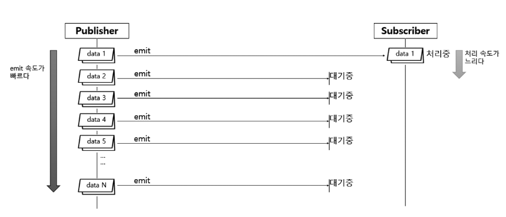

# [Spring-Reactive] Reactor (Sequence, Backpressure)

<!--more-->
<!-- Table of contents -->
* this unordered seed list will be replaced by the toc
{:toc}

<!-- text -->

# Sequence
- 리액터는 두가지 데이터 흐름인 Cold Sequence와 Hot Sequence라는 두 가지 유형이 있다.
  - Cold Sequence : Subscriber가 구독할 때마다 타임라인의 처음부터 emit된 모든 데이터를 받을 수 있다
  - Hot Sequence : Subscriber가 구독한 시점의 타임라인부터 emit된 데이터를 받을 수 있다.

## Cold Sequence


### 예제

```java
public class ColdSequenceExample {
    public static void main(String[] args) {
        Flux<String> coldFlux = Flux.fromIterable(Arrays.asList("RED", "YELLOW", "PINK"))
                .map(String::toLowerCase);

        coldFlux.subscribe(country -> Logger.info("# Subscriber1: {}", country));
        Logger.info("-------------------------");
        coldFlux.subscribe(country -> Logger.info("# Subscriber2: {}", country));
    }
}
```

### 결과


## Hot Sequence


### 예제

```java
public class HotSequenceExample {
    public static void main(String[] args) {
        Flux<String> concertFlux =
                Flux.fromStream(Stream.of("Singer A", "Singer B", "Singer C", "Singer D", "Singer E"))
                        .delayElements(Duration.ofSeconds(1)).share();  //  share() 원본 Flux를 여러 Subscriber가 공유한다.

        concertFlux.subscribe(singer -> Logger.info("# Subscriber1 is watching {}'s song.", singer));

        TimeUtils.sleep(2500);

        concertFlux.subscribe(singer -> Logger.info("# Subscriber2 is watching {}'s song.", singer));

        TimeUtils.sleep(3000);
    }
}
```

### 결과


## HTTP 요청/응답에서 Cold & Hot Sequence

### 핵심 요약
- **Cold Sequence**: 구독할 때마다 HTTP 요청이 새로 발생. (구독자마다 개별 요청)
- **Hot Sequence**: 첫 요청 결과를 캐시(Cache)하여 이후 구독자도 같은 데이터를 공유.

### 코드 설명
**[Cold Sequence 코드]**
```java
Mono<String> mono = getWorldTime(worldTimeUri);
mono.subscribe(...); // 첫 번째 요청
Thread.sleep(2000);
mono.subscribe(...); // 두 번째 요청 (새로 요청)

// 리턴값(2초 간격으로 서로 다른 시간이 출력)
// # dateTime 1: 2022-02-21T14:55:06.356239+09:00
// # dateTime 2: 2022-02-21T14:55:08.356239+09:00

```
- `getWorldTime()` 호출할 때마다 **HTTP 요청**이 새로 발생.
- 두 구독자가 각각 다른 시점의 데이터를 받음.

**[Hot Sequence 코드]**
```java
Mono<String> mono = getWorldTime(worldTimeUri).cache();
mono.subscribe(...); // 첫 번째 요청
Thread.sleep(2000);
mono.subscribe(...); // 두 번째 요청 (캐시 데이터 재사용)

// 리턴값(2초 간격이지만 같은 시간 출력)
// # dateTime 1: 2022-02-21T15:25:18.228149+09:00
// # dateTime 2: 2022-02-21T15:25:18.228149+09:00
```
- `.cache()` 사용 → **첫 번째 구독 시 요청한 결과를 저장**.
- 이후 구독자는 **새 요청 없이** 같은 데이터 전달받음.

### 기억해야 할 것
- `share()`: Flux(여러 데이터) 공유 → Hot Sequence
- `cache()`: Mono/Flux(단일 또는 여러 데이터) 캐싱 → Hot Sequence
- Cold ➔ Hot 변환: **share(), cache()** 같은 Operator 사용.

### Hot의 두 가지 의미 (짧은 요약)
- Warm-up 의미
  - 최초 구독자가 있어야 Publisher가 데이터를 emit 시작하는 경우.(예: share())
  - ➔ 구독자가 생기기 전에는 emit 안 함.

- Always-on 의미
  - 구독자 여부와 상관없이 Publisher가 데이터를 emit하는 경우.
  - ➔ 항상 emit되고, 늦게 구독하면 지나간 데이터는 못 받음


# Backpressure
- Publisher에서 emit되는 데이터를 Subscriber쪽에서 안정적으로 처리하기 위한 제어 기능
- 요청 데이터의 개수를 제어하는 방법 : Subscriber가 적절히 처리할 수 있는 수준의 데이터 개수를 Publisher에게 요청
- Backpressure는 데이터 스트림에서 소비자가 생산자보다 느릴 때 발생할 수 있는 문제를 해결하기 위한 메커니즘



> 위 예제는 Backpressure가 왜 필요한지를 보여 주는 Publisher와 Subscriber 간의 데이터 처리 흐름이다.  
> 먼저 Publisher가 data 1을 Subscriber에게 emit한다. 그런데 Subscriber가 data 1을 처리하는 속도가 느려서 처리가 끝나기도 전에 다른 데이터들이 emit된다.  
> 이 상황이 지속되어 오버플로나 시스템 다운이 되는것을 방지하기 위한 수단으로 Backpressure를 사용한다.

**Tip**  
리액터에서는 단순히 마지막에 데이터를 받는 Subscriber뿐만 아니라, 중간에서 데이터를 전달받고 또 전달하는 Operator들도 모두 Downstream Publisher로 본다.
  
## 예제
- hookOnSubscribe(): 최초 1개 데이터 요청
- hookOnNext(): 데이터 1개 처리 후 다시 1개 요청
- Thread.sleep()을 통해 일부러 처리 속도를 늦춰서 Backpressure 효과를 확인


```java
Flux.range(1, 5)
    .doOnRequest(data -> log.info("# doOnRequest: {}", data))
    .subscribe(new BaseSubscriber<Integer>() {
        protected void hookOnSubscribe(Subscription subscription) {
            request(1); // 처음에 1개 요청
        }

        protected void hookOnNext(Integer value) {
            Thread.sleep(2000); // 일부러 지연 (2초)
            log.info("# hookOnNext: {}", value);
            request(1); // 하나 처리했으니 다음 1개 또 요청
        }
    });

```

## 전략
- IGNORE 전략 : Backpressure를 적용하지 않는다.
- ERROR 전략 : Downstream으로 전달할 데이터가 버퍼에 가득 찰 경우, Exception을 발생시키는 전략
- DROP 전략 : Downstream으로 전달할 데이터가 버퍼에 가득 찰 경우, 버퍼 밖에서 대기하는 먼저 emit 된 데이터부터 Drop 시키는 전략
- LATEST 전략 : Downstream으로 전달할 데이터가 버퍼에 가득 찰 경우, 버퍼 밖에서 대기하는 가장 최근에(나중에) emit 된 데이터부터 버퍼에 채우는 전략
- BUFFER 전략 : Downstream으로 전달할 데이터가 버퍼에 가득 찰 경우, 버퍼 안에 있는 데이터를 Drop 시키는 전략

---

### IGNORE 전략
- Subscriber가 처리 가능한 만큼의 request 개수를 조절하는 Backpressure 예제

```java
public class BackpressureExample01 {
    public static void main(String[] args) {
        Flux.range(1, 5)
            .doOnNext(Logger::doOnNext)
            .doOnRequest(Logger::doOnRequest)
            .subscribe(new BaseSubscriber<Integer>() {
                @Override
                protected void hookOnSubscribe(Subscription subscription) {
                    // 구독이 시작될 때 호출됨
                    // 처음에 한 개의 아이템을 요청
                    request(1);
                }

                @Override
                protected void hookOnNext(Integer value) {
                    // 새로운 아이템이 발행될 때마다 호출됨
                    TimeUtils.sleep(2000L);
                    Logger.onNext(value);
                    request(1);
                }
            });
    }
}


public class BackpressureExample02 {
    public static int count = 0;
    public static void main(String[] args) throws InterruptedException {
        Flux.range(1, 5)
            .doOnNext(Logger::doOnNext)
            .doOnRequest(Logger::doOnRequest)
            .subscribe(new BaseSubscriber<Integer>() {
                @Override
                protected void hookOnSubscribe(Subscription subscription) {
                    // 구독이 시작될 때 호출됨
                    // 처음에 두 개의 아이템을 요청
                    request(2);
                }
    
                @Override
                protected void hookOnNext(Integer value) {
                    // 새로운 아이템이 발행될 때마다 호출됨
                    count++;
                    Logger.onNext(value);
                    if (count == 2) {
                        TimeUtils.sleep(2000L);
                        request(2);
                        count = 0;
                    }
                }
            });
    }
}
```

### ERROR 전략 예시
> Downstream의 처리 속도가 느려서 Upstream의 빠른 emit을 따라가지 못할 경우 예외를 발생시켜 흐름을 종료.

```java
Flux.interval(Duration.ofMillis(1))         // 0.001초마다 emit
    .onBackpressureError()                  // ERROR 전략 적용
    .publishOn(Schedulers.parallel())       // 별도 스레드에서 처리
    .subscribe(data -> {
        Thread.sleep(5);                    // 처리 속도 지연 (0.005초)
    });

```

| 단계            | 설명|
|---------------|---|
| 1. 빠른 emit 시작 | Flux.interval(Duration.ofMillis(1)) → 1ms마다 1씩 증가한 값을 emit|
 | 2. 느린 처리 설정   | subscribe() 내 Thread.sleep(5) → 5ms마다 1건 처리|
 | 3. 처리량 초과     | Publisher는 초당 약 1000건, Subscriber는 초당 약 200건 처리|
 | 4. 버퍼 초과      | Subscriber가 backlog(버퍼)를 따라잡지 못하고 점점 밀림|
 | 5. ERROR 발생   | onBackpressureError()에 의해 OverflowException 발생 후 시퀀스 종료|
 | 6. 에러 로그 출력   | # onError와 함께 예외 로그 출력됨|

### DROP 전략
> 버퍼 밖에서 대기하는 먼저 emit 된 데이터를 Drop 시키는 전략


```java
/**
 * Unbounded request 일 경우, Downstream 에 Backpressure Drop 전략을 적용하는 예제
 *  - Downstream 으로 전달 할 데이터가 버퍼에 가득 찰 경우, 버퍼 밖에서 대기하는 먼저 emit 된 데이터를 Drop 시키는 전략
 */
public class BackpressureStrategyDropExample {
    public static void main(String[] args) {
        Flux
            .interval(Duration.ofMillis(1L))
            .onBackpressureDrop(dropped -> Logger.info("# dropped: {}", dropped))
            .publishOn(Schedulers.parallel())
            .subscribe(data -> {
                    TimeUtils.sleep(5L);
                    Logger.onNext(data);
                },
                error -> Logger.onError(error));

        TimeUtils.sleep(2000L);
    }
}
```

### LATEST 전략
- DROP 전략과의 차이점은 DROP은 즉시 삭제가 되고, LATEST는 다음 데이터가 들어오면 들어온 최신 데이터를 놔두고 이전 최신 데이터가 삭제가 된다.  
- DROP 전략은 버퍼 밖에서 대기 중인 데이터를 하나씩 차례대로 Drop하면서 폐기, LATEST 전략은 새로운 데이터가 들어오는 시점에 가장 최근의 데이터만 남겨 두고 나머지 폐기.


```java
/**
 * Unbounded request 일 경우, Downstream 에 Backpressure Latest 전략을 적용하는 예제
 *  - Downstream 으로 전달 할 데이터가 버퍼에 가득 찰 경우,
 *    버퍼 밖에서 폐기되지 않고 대기하는 가장 나중에(최근에) emit 된 데이터부터 버퍼에 채우는 전략
 */
public class BackpressureStrategyLatestExample {
    public static void main(String[] args) {
        Flux
                .interval(Duration.ofMillis(1L))
                .onBackpressureLatest()
                .publishOn(Schedulers.parallel())
                .subscribe(data -> {
                        TimeUtils.sleep(5L);
                        Logger.onNext(data);
                    },
                    error -> Logger.onError(error));

        TimeUtils.sleep(2000L);
    }
}
```

### BUFFER 전략
- 버퍼의 데이터를 조절하는 전략으로 버퍼링, 폐기, 에러등의 전략이 있다. 
- Buffer DROP_LATEST 전략과 Buffer DROP_OLDEST 전략이 있다.

#### DROP_LATEST 전략


```java
/**
 * Unbounded request 일 경우, Downstream 에 Backpressure Buffer DROP_LATEST 전략을 적용하는 예제
 *  - Downstream 으로 전달 할 데이터가 버퍼에 가득 찰 경우,
 *    버퍼 안에 있는 데이터 중에서 가장 최근에(나중에) 버퍼로 들어온 데이터부터 Drop 시키는 전략
 */
public class BackpressureStrategyBufferDropLatestExample {
    public static void main(String[] args) {
        Flux
            .interval(Duration.ofMillis(300L))
            .doOnNext(data -> Logger.info("# emitted by original Flux: {}", data))
            .onBackpressureBuffer(2,
                    dropped -> Logger.info("# Overflow & dropped: {}", dropped),
                    BufferOverflowStrategy.DROP_LATEST)
            .doOnNext(data -> Logger.info("# emitted by Buffer: {}", data))
            .publishOn(Schedulers.parallel(), false, 1)
            .subscribe(data -> {
                    TimeUtils.sleep(1000L);
                    Logger.onNext(data);
                },
                error -> Logger.onError(error));

        TimeUtils.sleep(3000L);
    }
}
```

#### DROP_OLDEST 전략


```java
/**
 * Unbounded request 일 경우, Downstream 에 Backpressure Buffer DROP_OLDEST 전략을 적용하는 예제
 *  - Downstream 으로 전달 할 데이터가 버퍼에 가득 찰 경우,
 *    버퍼 안에 있는 데이터 중에서 가장 먼저 버퍼로 들어온 오래된 데이터부터 Drop 시키는 전략
 */
public class BackpressureStrategyBufferDropOldestExample {
    public static void main(String[] args) {
        Flux
            .interval(Duration.ofMillis(300L))
            .doOnNext(data -> Logger.info("# emitted by original Flux: {}", data))
            .onBackpressureBuffer(2,
                    dropped -> Logger.info("# Overflow & dropped: {}", dropped),
                    BufferOverflowStrategy.DROP_OLDEST)
            .doOnNext(data -> Logger.info("# emitted by Buffer: {}", data))
            .publishOn(Schedulers.parallel(), false, 1)
            .subscribe(data -> {
                        TimeUtils.sleep(1000L);
                        Logger.onNext(data);
                    },
                    error -> Logger.onError(error));

        TimeUtils.sleep(3000L);
    }
}
```