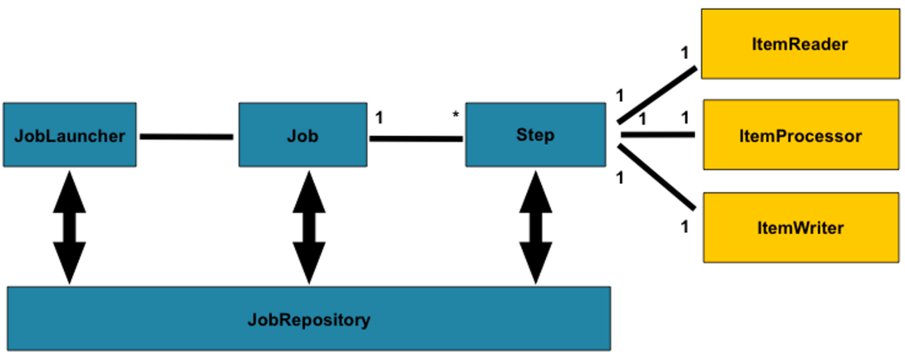
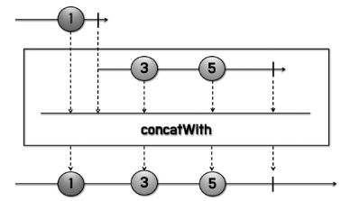
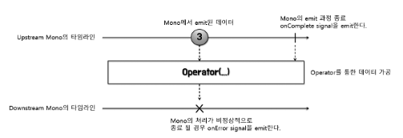
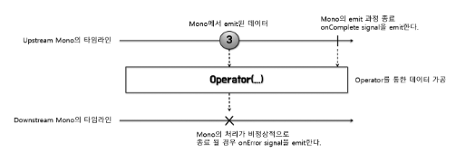

# [Spring-Reactive] Reactor (Scheduler)

<!--more-->
<!-- Table of contents -->
* this unordered seed list will be replaced by the toc
{:toc}

<!-- text -->

## Scheduler란?
- 리액터에서 Scheduler는 비동기 작업을 실행할 스레드나 스레드 풀을 지정하는 메커니즘
- Scheduler를 위한 전용 Operator :
  - publishOn( ) : Operator 체인에서 Downstream Operator의 실행을 위한 쓰레드를 지정한다.
  - subscribeOn( ) : 최상위 Upstream Publisher의 실행을 위한 쓰레드를 지정한다. 즉, 원본 데이터 소스를 emit 하기 위한 스케줄러를 지정한다.
  - parallel( ) : Downstream에 대한 데이터 처리를 병렬로 분할 처리하기 위한 쓰레드를 지정한다.

### parallel

```java

import com.itvillage.utils.Logger;
import reactor.core.publisher.Flux;

/**
 * parallel()만 사용할 경우에는 병렬로 작업을 수행하지 않는다.
 */
public class ParallelExample01 {
    public static void main(String[] args) {
        Flux.fromArray(new Integer[]{1, 3, 5, 7, 9, 11, 13, 15})
                .parallel()
                .subscribe(Logger::onNext);
    }
}

/**
 * - parallel()만 사용할 경우에는 병렬로 작업을 수행하지 않는다.
 * - runOn()을 사용해서 Scheduler를 할당해주어야 병렬로 작업을 수행한다.
 * - **** CPU 코어 갯수내에서 worker thread를 할당한다. ****
 */
public class ParallelExample03 {
  public static void main(String[] args) {
    Flux.fromArray(new Integer[]{1, 3, 5, 7, 9, 11, 13, 15, 17, 19})
            .parallel()
            .runOn(Schedulers.parallel())
            .subscribe(Logger::onNext);

    TimeUtils.sleep(100L);
  }
}


/**
 * - parallel()만 사용할 경우에는 병렬로 작업을 수행하지 않는다.
 * - runOn()을 사용해서 Scheduler를 할당해주어야 병렬로 작업을 수행한다.
 * - **** CPU 코어 갯수에 의존하지 않고, worker thread를 강제 할당한다. ****
 */
public class ParallelExample04 {
  public static void main(String[] args) {
    Flux.fromArray(new Integer[]{1, 3, 5, 7, 9, 11, 13, 15, 17, 19})
            .parallel(4)
            .runOn(Schedulers.parallel())
            .subscribe(Logger::onNext);

    TimeUtils.sleep(100L);
  }
}
```


### publishOn & subscribeOn

```java
/**
 * Operator 체인에서 publishOn( )이 호출되면 publishOn( ) 호출 이후의 Operator 체인은
 * 다음 publisherOn( )을 만나기전까지 publishOn( )에서 지정한 Thread에서 실행이 된다.
 */
public class SchedulerOperatorExample02 {
    public static void main(String[] args) {
        Flux.fromArray(new Integer[] {1, 3, 5, 7})
                .doOnNext(data -> Logger.doOnNext("fromArray", data))
                .publishOn(Schedulers.parallel())
                .filter(data -> data > 3)
                .doOnNext(data -> Logger.doOnNext("filter", data))
                .map(data -> data * 10)
                .doOnNext(data -> Logger.doOnNext("map", data))
                .subscribe(Logger::onNext);

        TimeUtils.sleep(500L);
    }
}
```


```java
/**
 * Operator 체인에서 publishOn( )이 호출되면 publishOn( ) 호출 이후의 Operator 체인은
 * *** 다음 publisherOn( )을 만나기전까지 *** publishOn( )에서 지정한 Thread에서 실행이 된다.
 */
public class SchedulerOperatorExample03 {
    public static void main(String[] args) {
        Flux.fromArray(new Integer[] {1, 3, 5, 7})
                .doOnNext(data -> Logger.doOnNext("fromArray", data))
                .publishOn(Schedulers.parallel())
                .filter(data -> data > 3)
                .doOnNext(data -> Logger.doOnNext("filter", data))
                .publishOn(Schedulers.parallel())
                .map(data -> data * 10)
                .doOnNext(data -> Logger.doOnNext("map", data))
                .subscribe(Logger::onNext);

        TimeUtils.sleep(500L);
    }
}
```


```java
/**
 * subscribeOn()은 구독 직후에 실행 될 쓰레드를 지정한다.
 * 즉, 원본 Publisher의 실행 쓰레드를 subscribeOn()에서 지정한 쓰레드로 바꾼다.
 */
public class SchedulerOperatorExample04 {
    public static void main(String[] args) {
        Flux.fromArray(new Integer[] {1, 3, 5, 7})
                .subscribeOn(Schedulers.boundedElastic())
                .doOnNext(data -> Logger.doOnNext("fromArray", data))
                .filter(data -> data > 3)
                .doOnNext(data -> Logger.doOnNext("filter", data))
                .map(data -> data * 10)
                .doOnNext(data -> Logger.doOnNext("map", data))
                .subscribe(Logger::onNext);

        TimeUtils.sleep(500L);
    }
}
```


```java
/**
 * subscribeOn( )과 publishOn( )이 같이 있다면, publishOn( )을 만나기 전 까지의 Upstream Operator 체인은
 * subscribeOn( )에서 지정한 쓰레드에서 실행되고, publishOn( )을 만날때마다
 * publishOn( ) 아래의 Operator 체인 downstream은 publishOn( )에서 지정한 쓰레드에서 실행된다.
 */
public class SchedulerOperatorExample05 {
    public static void main(String[] args) {
        Flux.fromArray(new Integer[] {1, 3, 5, 7})
                .subscribeOn(Schedulers.boundedElastic())
                .filter(data -> data > 3)
                .doOnNext(data -> Logger.doOnNext("filter", data))
                .publishOn(Schedulers.parallel())
                .map(data -> data * 10)
                .doOnNext(data -> Logger.doOnNext("map", data))
                .subscribe(Logger::onNext);

        TimeUtils.sleep(500L);
    }
}
```


```java
/**
 * subscribeOn( )과 publishOn( )이 같이 있다면, publishOn( )을 만나기 전 까지의 Upstream Operator 체인은
 * subscribeOn( )에서 지정한 쓰레드에서 실행되고, publishOn( )을 만날때마다
 * publishOn( ) 아래의 Operator 체인 downstream은 publishOn( )에서 지정한 쓰레드에서 실행된다.
 */
public class SchedulerOperatorExample06 {
    public static void main(String[] args) {
        Flux.fromArray(new Integer[] {1, 3, 5, 7})
                .doOnNext(data -> Logger.doOnNext("fromArray", data))
                .publishOn(Schedulers.parallel())
                .filter(data -> data > 3)
                .doOnNext(data -> Logger.doOnNext("filter", data))
                .subscribeOn(Schedulers.boundedElastic())
                .map(data -> data * 10)
                .doOnNext(data -> Logger.doOnNext("map", data))
                .subscribe(Logger::onNext);

        TimeUtils.sleep(500L);
    }
}
```


### immediate

```java
/**
 * Schedulers.immediate()을 적용 후,
 * 현재 쓰레드가 할당된다.
 */
public class SchedulersImmediateExample02 {
    public static void main(String[] args) {
        Flux.fromArray(new Integer[] {1, 3, 5, 7})
                .publishOn(Schedulers.parallel())
                .filter(data -> data > 3)
                .doOnNext(data -> Logger.doOnNext("filter", data))
                .publishOn(Schedulers.immediate())
                .map(data -> data * 10)
                .doOnNext(data -> Logger.doOnNext("map", data))
                .subscribe(Logger::onNext);

        TimeUtils.sleep(200L);
    }
}
```


### single

```java
/**
 * Schedulers.single()을 적용 할 경우,
 * Schedulers.single()에서 할당된 쓰레드를 재사용 한다.
 * 두번의 subscribe 모두 같은 쓰레드를 사용한다.
 */
public class SchedulersSingleExample01 {
    public static void main(String[] args) {
        doTask("task1")
                .subscribe(Logger::onNext);

        doTask("task2")
                .subscribe(Logger::onNext);

        TimeUtils.sleep(200L);
    }

    private static Flux<Integer> doTask(String taskName) {
        return Flux.fromArray(new Integer[] {1, 3, 5, 7})
                .publishOn(Schedulers.single())
                .filter(data -> data > 3)
                .doOnNext(data -> Logger.doOnNext(taskName, "filter", data))
                .map(data -> data * 10)
                .doOnNext(data -> Logger.doOnNext(taskName, "map", data));
    }
}
```



```java
/**
 * Schedulers.single()을 적용 후,
 * 첫번째 Schedulers.single()에서 할당 된 쓰레드를 재사용 한다.
 * newSingle은 호출 할때 마다 매번 새로운 쓰레드를 호출한다.
 */
public class SchedulersSingleExample02 {
    public static void main(String[] args) {

        doTask("task1")
                .subscribe(Logger::onNext);

        doTask("task2")
                .subscribe(Logger::onNext);


        TimeUtils.sleep(200L);
    }

    private static Flux<Integer> doTask(String taskName) {
        return Flux.fromArray(new Integer[] {1, 3, 5, 7})
                .doOnNext(data -> Logger.doOnNext(taskName, "fromArray", data))
                .publishOn(Schedulers.newSingle("new-single", true))
                .filter(data -> data > 3)
                .doOnNext(data -> Logger.doOnNext(taskName, "filter", data))
                .map(data -> data * 10)
                .doOnNext(data -> Logger.doOnNext(taskName, "map", data));
    }
}
```



### newBoundedElastic

```java
/**
 * Schedulers.newBoundedElastic()을 적용
 * 변수 : 쓰레드 갯수, 큐 갯수, 쓰레드 이름
 */
public class SchedulersNewBoundedElasticExample01 {
    public static void main(String[] args) {
        Scheduler scheduler = Schedulers.newBoundedElastic(2, 2, "I/O-Thread");
        Mono<Integer> mono =
                    Mono
                        .just(1)
                        .subscribeOn(scheduler);

        Logger.info("# Start");

        mono.subscribe(data -> {
            Logger.onNext("subscribe 1 doing", data);
            TimeUtils.sleep(3000L);
            Logger.onNext("subscribe 1 done", data);
        });

        mono.subscribe(data -> {
            Logger.onNext("subscribe 2 doing", data);
            TimeUtils.sleep(3000L);
            Logger.onNext("subscribe 2 done", data);
        });

        mono.subscribe(data -> {
            Logger.onNext("subscribe 3 doing", data);
        });

        mono.subscribe(data -> {
            Logger.onNext("subscribe 4 doing", data);
        });

        mono.subscribe(data -> {
            Logger.onNext("subscribe 5 doing", data);
        });

        mono.subscribe(data -> {
            Logger.onNext("subscribe 6 doing", data);
        });

//        TimeUtils.sleep(4000L);
//        scheduler.dispose();
    }
}
```



### newParallel

```java
/**
 * Schedulers.newParallel()을 적용
 * 변수 : 쓰레드 이름, 쓰레드 갯수, 데몬쓰레드 동작 여부
 */
public class SchedulersNewParallelExample01 {
    public static void main(String[] args) {
        Mono<Integer> flux =
                    Mono
                        .just(1)
                        .publishOn(Schedulers.newParallel("Parallel Thread", 4, true));


        flux.subscribe(data -> {
            TimeUtils.sleep(5000L);
            Logger.onNext("subscribe 1", data);
        });

        flux.subscribe(data -> {
            TimeUtils.sleep(4000L);
            Logger.onNext("subscribe 2", data);
        });

        flux.subscribe(data -> {
            TimeUtils.sleep(3000L);
            Logger.onNext("subscribe 3", data);
        });

        flux.subscribe(data -> {
            TimeUtils.sleep(2000L);
            Logger.onNext("subscribe 4", data);
        });

        TimeUtils.sleep(6000L);
    }
}
```

